# Synthetix

English | [简体中文](#简体中文)

<p align="center">
  
</p>

<p align="center">
  <strong>Self-hosted AI knowledge and long-form writing workbench for large document collections.</strong>
</p>

<p align="center">
  <a href="./LICENSE"></a>
  
  
  
  
</p>

<p align="center">
  <a href="#why-synthetix">Why</a> ·
  <a href="#core-workflows">Workflows</a> ·
  <a href="#quick-start">Quick start</a> ·
  <a href="#how-it-works">Architecture</a> ·
  <a href="#documentation">Docs</a>
</p>

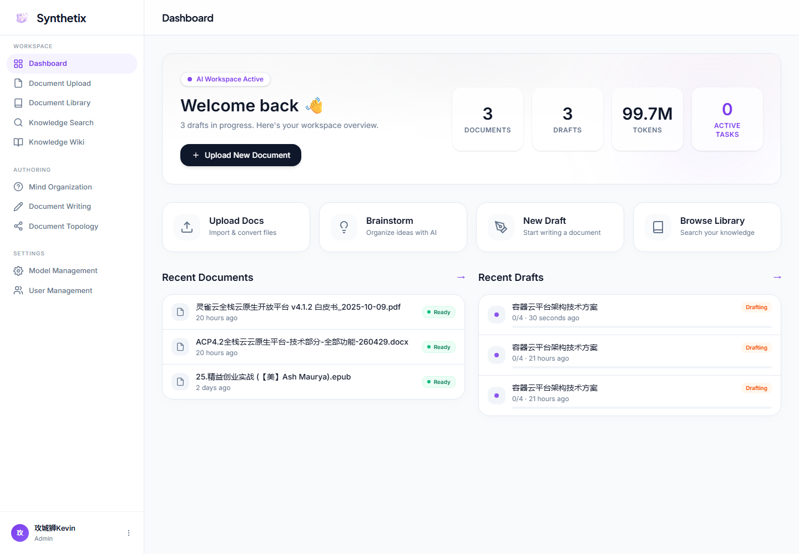

## What is Synthetix?

Synthetix is a self-hosted AI workbench for people who need to turn large collections of source documents into structured, traceable long-form output.

It is designed for research reports, technical proposals, consulting documents, product and project documentation, and other serious writing tasks where the source material is too large for a single AI conversation and the final document needs to stay coherent across many sections.

Instead of treating your files as one-off attachments, Synthetix converts them into a layered knowledge base, then uses that knowledge base to support search, Wiki synthesis, graph exploration, guided outlining, section-by-section writing, model comparison, source references, topology analysis, and export.

## Why Synthetix?

General AI chat tools and basic RAG apps are useful, but they usually break down in three places when used for serious document production:

1. **Large source material exceeds a single model context.** A hundred-page specification, a folder of reports, or a private knowledge base cannot be reliably handled as one prompt.
2. **Generated text often lacks inspectable provenance.** Professional writing needs to answer: which documents support this section, and where did this claim come from?
3. **Traditional RAG does not accumulate knowledge.** It retrieves chunks again and again, but the system does not build a reusable, human-readable understanding of the corpus over time.

Synthetix is built around these problems. It combines a three-layer knowledge architecture, a Wiki-based knowledge flywheel, and a stateful writing workflow so that long documents can be generated, reviewed, traced, revised, and exported from a durable knowledge base.

## Table of contents

- [Screenshots](#screenshots)
- [Core workflows](#core-workflows)
- [What makes it different?](#what-makes-it-different)
- [MCP integration (drive Synthetix from AI agents) · MCP 集成(用 AI 智能体驱动)](#mcp-integration-drive-synthetix-from-ai-agents--mcp-集成用-ai-智能体驱动)
- [Supported formats](#supported-formats)
- [Model and backend flexibility](#model-and-backend-flexibility)
- [Recommended embedding models for the knowledge graph](#recommended-embedding-models-for-the-knowledge-graph)
- [Quick start](#quick-start)
- [First successful workflow](#first-successful-workflow)
- [Configuration](#configuration)
- [How it works](#how-it-works)
- [Current status and limitations](#current-status-and-limitations)
- [Documentation](#documentation)
- [Development](#development)
- [Contributing](#contributing)
- [Security and privacy](#security-and-privacy)
- [License](#license)

## Screenshots

A quick tour of the main product surfaces. The screenshots below are captured from a local self-hosted workspace.

<details open>
<summary>Dashboard</summary>


Workspace overview with document status, draft status, token usage, and entry points into upload, brainstorming, writing, and the library.
</details>

<details>
<summary>Document library</summary>

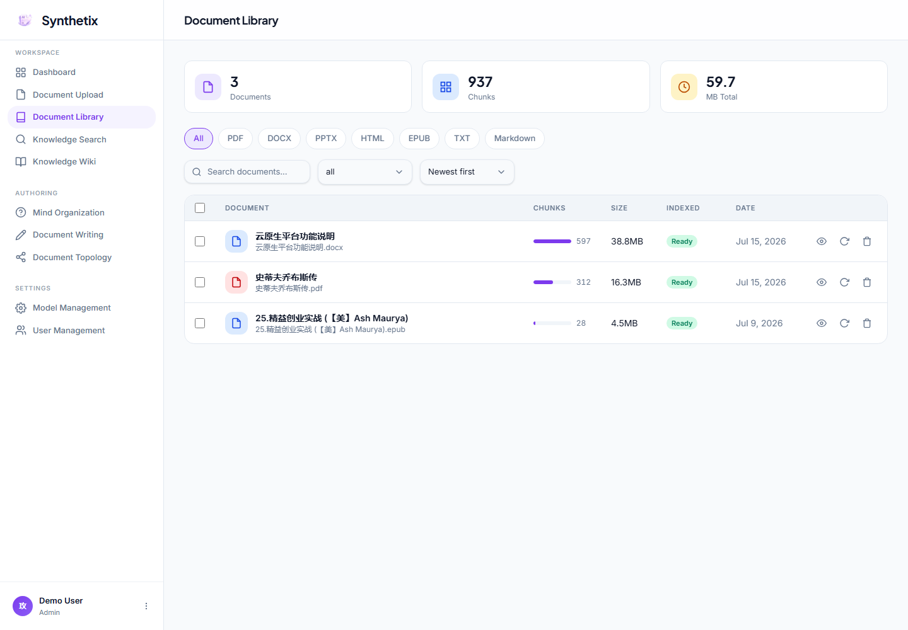

Uploaded documents, processing status, metadata, and library-level management.
</details>

<details>
<summary>Knowledge search</summary>

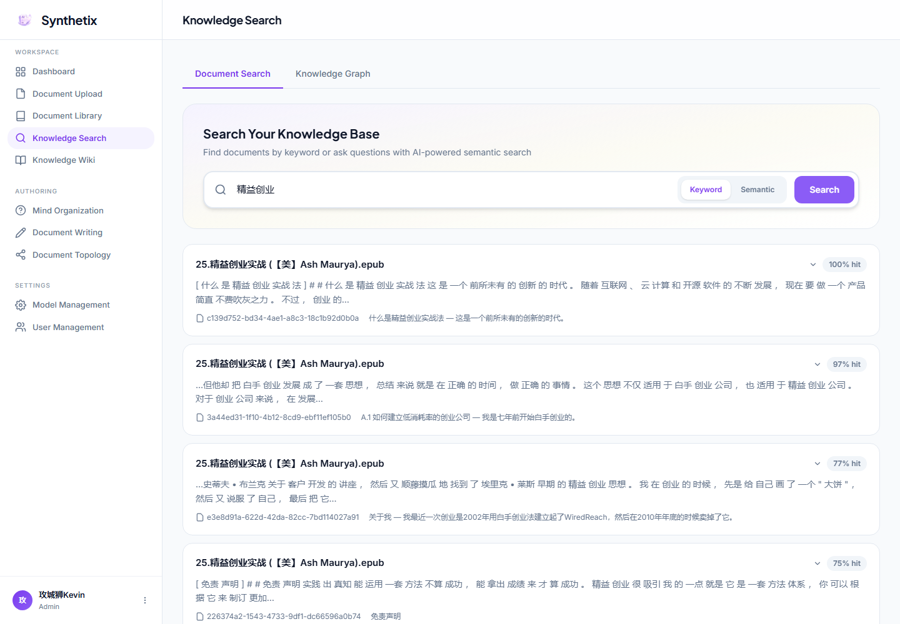

Keyword and semantic search over indexed document chunks, with relevance scores and source previews.
</details>

<details>
<summary>Knowledge graph</summary>

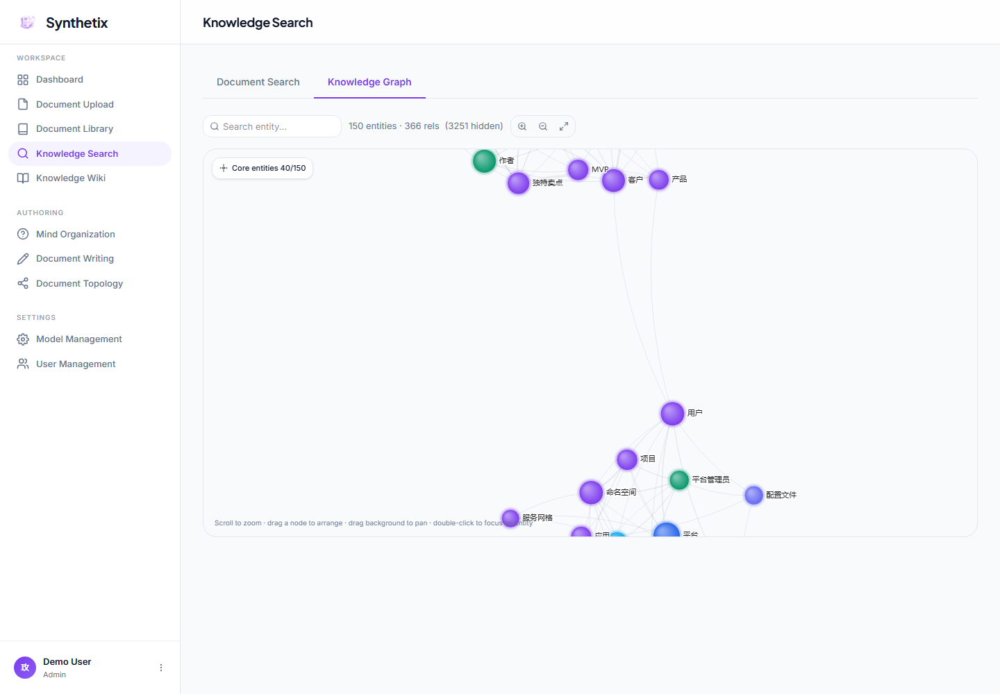

A force-directed graph of entities and relationships extracted by LightRAG — inspect conceptual structure and connections across the document corpus.
</details>

<details>
<summary>Knowledge Wiki</summary>

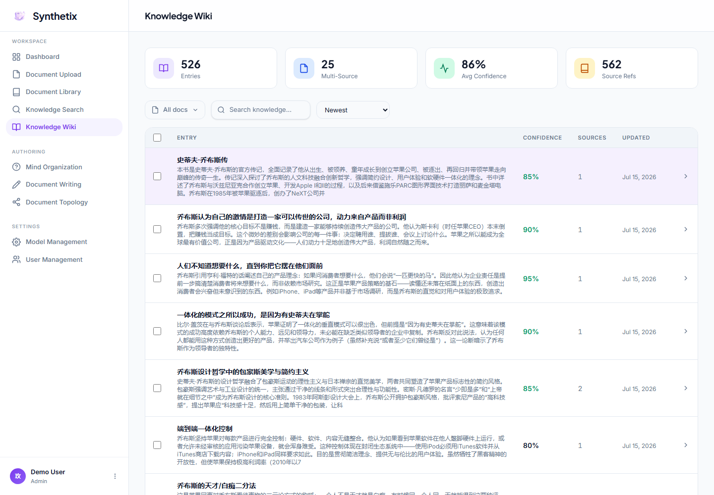

LLM-synthesized knowledge entries with confidence, source counts, search, filtering, and edit/export workflows.
</details>

<details>
<summary>Mind organization</summary>

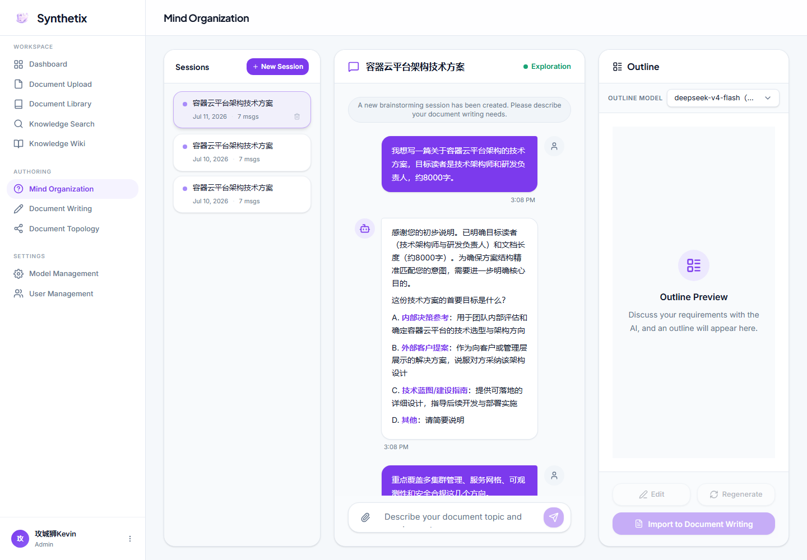

A guided brainstorm flow for clarifying goals, scope, audience, and document shape before writing starts.
</details>

<details>
<summary>Writing workbench</summary>

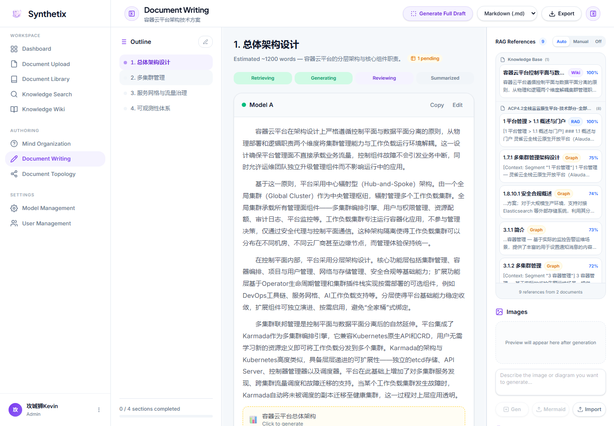

Section-by-section writing with outline context, generation state, references, model comparison, versions, and export.
</details>

<details>
<summary>Document topology</summary>

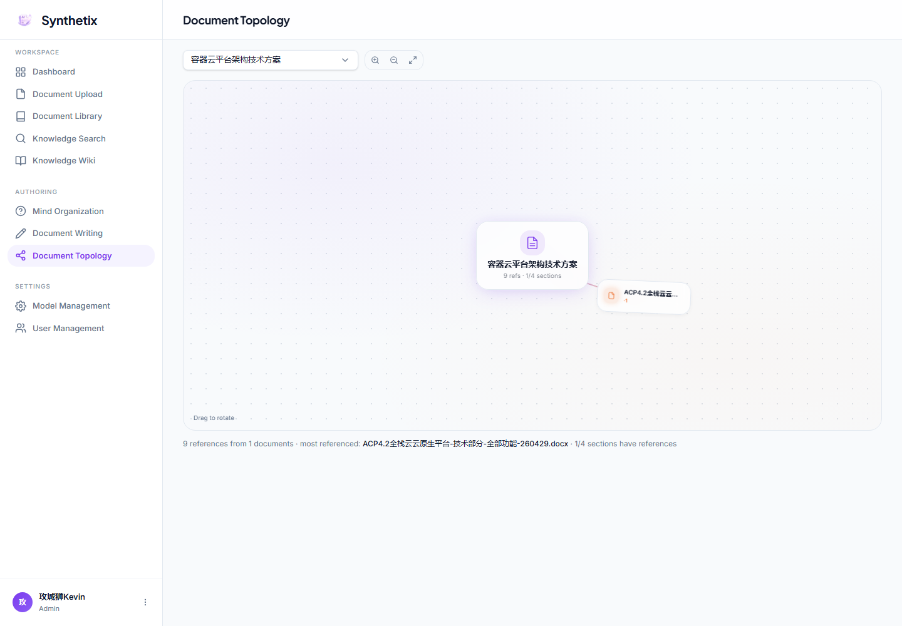

A force-directed topology view that maps generated sections to the uploaded documents that support them.
</details>

<details>
<summary>Model usage statistics</summary>

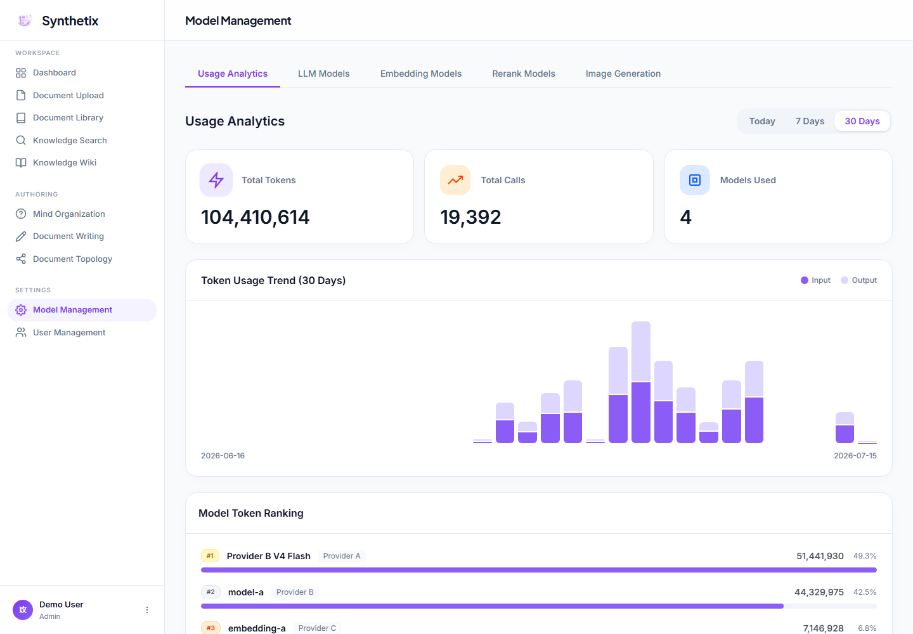

Token usage overview with summary cards, trend chart, per-model ranking, and module breakdown (brainstorm, writing, etc.).
</details>

## Core workflows

### 1. Build a knowledge base

Upload supported documents and turn them into a searchable, reusable knowledge base.

- Supported formats: **PDF, DOCX, PPTX, HTML, EPUB, TXT, Markdown/MD**.
- Documents are converted to Markdown, split into structured chunks, embedded, and indexed for full-text and semantic retrieval.
- Synthetix uses structure-aware splitting, local semantic micro-splitting, breadcrumbs, and LLM-guided domain segmentation to prepare different knowledge layers for different retrieval tasks.
- LightRAG graph indexing and Wiki synthesis run as background enhancements, so documents can become usable before every enrichment layer finishes.

### 2. Explore knowledge

Synthetix is not only a writing tool. It is also a knowledge exploration workspace.

- **Keyword search** uses SQLite FTS5 with Chinese tokenization support.
- **Semantic search** combines LightRAG retrieval, direct embedding fallback, keyword retrieval, and rank fusion.
- **LightRAG retrieval modes** include `local`, `global`, `hybrid`, `mix`, `naive`, and `bypass`; the `mix` mode combines graph, vector, and reranker-style retrieval.
- **Knowledge graph exploration** lets you browse extracted entities, relationships, graph neighborhoods, and evidence.
- **Knowledge Wiki** lets you browse, search, edit, and export synthesized entries with sources, confidence, links, backlinks, and change history.

### 3. Write long-form documents

Synthetix is built for multi-section writing, not one-shot answers.

- Start with a guided brainstorm session to clarify goals, scope, audience, and document shape.
- Generate a recursive outline that can be edited and reorganized before writing.
- Generate sections one by one using retrieved context from the knowledge base.
- Assemble section prompts with outline position, parent/sibling/child context, completed-section summaries, Wiki entries, RAG references, and graph-derived references.
- Compare two models on the same section context with A/B generation.
- Confirm versions, roll back previous versions, and export the final draft to Markdown, PDF, or DOCX.

### 4. Audit source coverage

For professional writing, the question is not only “does the text look good?” but also “what supports it?”

- Section references are persisted with source document, chunk, source type, relevance score, and supporting content.
- The reference panel separates raw RAG chunks, graph references, and Wiki entries.
- The document topology view shows which uploaded documents support which generated sections, including coverage statistics and most-referenced sources.

## What makes it different?

### Three-layer knowledge architecture

Most RAG systems stop at chunking and vector similarity. Synthetix separates knowledge into three layers, because each layer solves a different problem.

| Layer | Purpose | Why it matters |
| --- | --- | --- |
| **Raw chunks** | Verbatim document segments with embeddings and full-text indexes | Keeps source evidence traceable and inspectable. |
| **LightRAG entity graph** | LLM-extracted entities and relationships from the corpus | Captures concepts and connections that flat vector retrieval can miss. |
| **LLM Knowledge Wiki** | Human-readable synthesized entries: document summaries, topics, concepts, and claims | Turns repeated retrieval into reusable knowledge that can be inspected, edited, linked, and exported. |

This lets Synthetix combine evidence, relationships, and synthesis instead of relying on one retrieval strategy for every task.

### Knowledge flywheel

A common weakness of traditional RAG is that every query starts from raw retrieval again. Synthetix adds a Wiki-based flywheel:

```text
Documents
  -> chunks, graph, and Wiki entries
  -> writing queries the Wiki first
  -> raw retrieval is reduced when Wiki coverage is strong
  -> generated sections write new knowledge back into the Wiki
  -> cited entries gain confidence
  -> future retrieval starts from a richer knowledge base
```

The result is a knowledge base that can become more useful as you write against it. The Wiki is not just a cache; it is a readable synthesis layer that users can inspect and edit.

### Traceable writing workbench

Synthetix treats long-form writing as a workflow, not a single chat message.

It keeps state across brainstorm sessions, outlines, draft sections, model comparisons, references, section versions, topology analysis, and exports. Each section can be generated with its own targeted context while still respecting the surrounding outline and previously completed sections.

## MCP integration (drive Synthetix from AI agents) · MCP 集成(用 AI 智能体驱动)

EN: A companion MCP server bridges AI agents (Claude Code, Codex, OpenCode) to Synthetix over its REST API, so you can ingest documents, brainstorm, write with dual-model compare, and export — all by natural language, without opening the browser. Create an API key in **Settings → API Keys**, then connect the MCP server:

CN: 配套的 MCP server 通过 REST API 把 AI 智能体(Claude Code、Codex、OpenCode)接入 Synthetix,你可以用自然语言摄入文档、头脑风暴、双模型写作、导出——全程不用打开浏览器。在「设置 → API 密钥」创建一个 key,然后连接 MCP server:

```bash
claude mcp add --scope user synthetix \
  -e SYNTHETIX_API_KEY=sk-synt-你的密钥 \
  -- npx -y @walkcloud/synthetix-mcp
```

→ MCP server 仓库:[WalkCloud/synthetix-mcp-tools](https://github.com/WalkCloud/synthetix-mcp-tools)(含完整工具清单、工作流 prompt、各客户端配置)

## Supported formats

Synthetix currently supports text-oriented document formats:

| Format | Extension |
| --- | --- |
| PDF | `.pdf` |
| Word | `.docx` |
| PowerPoint | `.pptx` |
| HTML | `.html` |
| EPUB | `.epub` |
| Plain text | `.txt` |
| Markdown | `.md` |

Spreadsheet formats are intentionally not listed here because they are not part of the current document-writing pipeline.

## Model and backend flexibility

Synthetix is designed to work with multiple model and retrieval backends.

| Area | Supported / planned options |
| --- | --- |
| LLM providers | OpenAI-compatible endpoints, Anthropic, Ollama |
| Local models | Ollama-compatible local services where applicable |
| Primary database | SQLite by default; PostgreSQL path exists for future/cloud-ready deployments |
| LightRAG storage | Local JSON/NanoVectorDB/NetworkX by default; optional PostgreSQL/pgvector, Neo4j, Milvus, Qdrant configuration |
| Desktop runtime | Windows Electron installer and source-based development runtime |

Whether the system is fully offline depends on the model providers you configure. If you use a remote LLM or embedding provider, relevant content is sent to that provider for processing. If you use local providers, more of the workflow can remain on your own machine.

## Recommended embedding models for the knowledge graph

The Knowledge Graph and Full Analysis modes use LightRAG for entity/relation extraction, which requires an embedding model with **at least 1536 dimensions**. Models with fewer dimensions (e.g. 768, 1024) silently disable graph mode and fall back to basic retrieval. The table below lists cloud embedding models that meet or exceed this threshold, so you know which services to choose when you want graph-enhanced retrieval.

| Model | Provider | Dimension | URL | Notes |
| --- | --- | --- | --- | --- |
| text-embedding-3-large | OpenAI | 3072 | [openai.com](https://openai.com) | supports dimension reduction |
| text-embedding-3-small | OpenAI | 1536 | [openai.com](https://openai.com) | cost-effective option |
| text-embedding-ada-002 | OpenAI | 1536 | [openai.com](https://openai.com) | early classic model |
| Gemini Embedding 2 | Google | 3072 | [ai.google.dev](https://ai.google.dev) | multimodal, supports dimension reduction |
| Nova Multimodal Embeddings | Amazon | 3072 | [aws.amazon.com/bedrock](https://aws.amazon.com/bedrock) | multimodal |
| solar-embedding-1-large | Upstage | 4096 | [upstage.ai](https://upstage.ai) | |
| text-embedding-v4 | Alibaba Cloud | up to 2048 | [aliyun.com](https://aliyun.com) | selectable 1536/1024 etc. |
| qwen3-vl-embedding | Alibaba Cloud | up to 2560 | [aliyun.com](https://aliyun.com) | multimodal |
| Qwen3-Embedding-8B | Alibaba Cloud (open-source) | up to 4096 | [aliyun.com](https://aliyun.com) | customizable |
| gte-Qwen2-7B-instruct | Alibaba Cloud (open-source) | 3584 | [aliyun.com](https://aliyun.com) | |
| Doubao-embedding-large | ByteDance | 2048 | [volcengine.com](https://volcengine.com) | supports dimension reduction |
| Seed1.6-Embedding | ByteDance | 2048 | [volcengine.com](https://volcengine.com) | |
| Embedding-3 | Zhipu AI | up to 2048 | [open.bigmodel.cn](https://open.bigmodel.cn) | customizable |
| kinfra-text-embedding-4b | Tencent Cloud | 2560 | [cloud.tencent.com](https://cloud.tencent.com) | fixed dimension |
| KaLM-Embedding | Tencent (open-source) | 3840/2048 | [cloud.tencent.com](https://cloud.tencent.com) | multi-tier support |
| Piccolo2 | SenseTime | 1792 | [sensetime.com](https://sensetime.com) | |
| jina-embeddings-v4 | Jina AI | 2048 | [jina.ai](https://jina.ai) | multimodal |
| voyage-4 series | Voyage AI | up to 2048 | [voyageai.com](https://voyageai.com) | supports dimension reduction |
| pplx-embed-v1-4b | Perplexity | 2560 | [docs.perplexity.ai](https://docs.perplexity.ai) | |
| zembed-1 | ZeroEntropy | 2560 | [zeroentropy.dev](https://zeroentropy.dev) | |
| embed-v4 | Cohere | 1536 | [cohere.com](https://cohere.com) | meets the threshold exactly |
| voyage-large-2 | Voyage AI | 1536 | [voyageai.com](https://voyageai.com) | meets the threshold exactly |

> **Note**: When adding an embedding model in Model Management, if the detected dimension is below 1536 a warning is shown. The document processing page also disables the Knowledge Graph / Full Analysis options for low-dimension models. Configure any model from the list above to enable graph-enhanced retrieval.

## Quick start

### Option A: Windows installer

Download the latest `.exe` installer from [GitHub Releases](https://github.com/WalkCloud/Synthetix/releases), install it, and launch Synthetix from the Start Menu.

### Option B: run from source

Prerequisites:

- Node.js 24.18.0 (supported range: `>=24.18.0 <25`)
- pnpm 11.15.0
- Python 3.14.6 (the development interpreter and packaged sidecar use the same version)
- macOS 12+ (Monterey or newer) when developing or running the macOS desktop build
- An OpenAI-compatible, Anthropic, DeepSeek-compatible, or Ollama endpoint

```bash
git clone https://github.com/WalkCloud/Synthetix.git
cd Synthetix

npm install
copy .env.example .env

npx prisma migrate dev
npx prisma generate

npm run dev
```

Open `http://localhost:3000`, create the first admin account, add a model provider in Settings, then upload a document.

Prefer pnpm? This repo ships a `pnpm-lock.yaml` — `pnpm install` works too.

## First successful workflow

After launching the app, a good first run is:

1. **Add a model provider** in Settings. Configure at least one chat-capable model and one embedding-capable model.
2. **Upload a supported document** such as a PDF, DOCX, PPTX, HTML, EPUB, TXT, or Markdown file.
3. **Process and index the document** so chunks, embeddings, full-text search, and background knowledge enhancements can be created.
4. **Inspect the knowledge base** through Search, Knowledge Wiki, or Knowledge Graph.
5. **Start a brainstorm session** to clarify the document you want to write.
6. **Generate and edit an outline**, then create a draft.
7. **Generate one section**, inspect its references, compare models if needed, and confirm the version.
8. **Open the topology view** to see which source documents support the draft.

## Configuration

Copy `.env.example` to `.env` and set at least these:

| Variable | Purpose |
| --- | --- |
| `JWT_SECRET` | Signs access and refresh tokens. Use a strong random value. |
| `NEXT_PUBLIC_APP_URL` | Public app URL, usually `http://localhost:3000` for local use. |

If your Python interpreter is not picked up automatically, point to it with `PYTHON_PATH`.

Model providers are configured in the app UI. Database paths, processing concurrency, and optional LightRAG backends are documented with comments in [`.env.example`](./.env.example).

## How it works

### Knowledge and writing flow

```text
Documents
  -> Markdown conversion
  -> structure-aware chunks + embeddings + full-text index
  -> LightRAG graph indexing
  -> LLM Wiki synthesis
  -> Wiki-first / RAG / graph-aware context assembly
  -> section generation, comparison, references, versions
  -> topology analysis and export
```

### System stack

```text
Browser
  React, Tailwind CSS, shadcn/ui, d3-force
        |
Next.js App Router
  pages, API routes, auth, settings, task queue
        |
Prisma + SQLite
        |
Python workers
  conversion, semantic chunking, LightRAG indexing, export
        |
LLM providers
  OpenAI-compatible, Anthropic, DeepSeek-compatible, Ollama, local services
```

### Key directories

| Path | Purpose |
| --- | --- |
| `src/app` | Next.js pages and API routes. |
| `src/lib/documents` | Document lifecycle, conversion, segmentation, chunks, indexing, and storage. |
| `src/lib/rag` | TypeScript bridge to LightRAG graph and query workers. |
| `src/lib/wiki` | Wiki synthesis, querying, merging, links, changelog, and export. |
| `src/lib/search` | Keyword, semantic, LightRAG, direct embedding, and fusion search. |
| `src/lib/writing` | Brainstorm, outline, context assembly, section generation, comparison, references, topology, export. |
| `workers/python` | Conversion, chunking, LightRAG indexing/query/manage, export workers. |
| `electron`, `packaging` | Desktop shell and Windows installer build scripts. |

## Current status and limitations

- Graph indexing and Wiki synthesis are background enhancements. A document can become usable before every enrichment layer has finished.
- Fully offline AI depends on local model providers. Remote model providers receive the content required for the configured task.
- Spreadsheet formats are not supported in the current document-writing pipeline.
- Text extraction and knowledge generation are the focus; high-fidelity reproduction of source-document images, spreadsheets, and layout is not the primary goal.
- Cloud sync, remote object storage, and remote vector/database backends are part of the cloud-ready direction, but not the default local workflow today.

## Documentation

- [Release workflow](docs/release-workflow.md)
- [Changelog](CHANGELOG.md)

## Development

```bash
npm run dev
npm run build
npm run lint
npm test
npm run test:run
npm run e2e
```

Prisma:

```bash
npx prisma generate
npx prisma migrate dev --name <change>
npx prisma studio
```

## Contributing

Issues and pull requests are welcome. For large changes, open an issue first so the design can be discussed before implementation.

Good first areas:

- setup and deployment documentation
- provider compatibility fixes
- tests for API routes, workers, writing flow, export, and update paths
- accessibility and UI polish
- documentation for model/provider configuration and troubleshooting

Please keep changes focused and include tests or verification notes when possible.

## Security and privacy

Synthetix is designed for self-hosted and offline-first workflows, but data boundaries depend on your deployment and model configuration.

- Uploaded files and application data are stored according to your local or configured backend.
- If you configure remote LLM, embedding, rerank, or image providers, relevant content is sent to those providers for processing.
- Using local providers such as Ollama-compatible services can reduce external data transfer.
- Future cloud-ready storage and database backends are intended to be optional, not a replacement for local/self-hosted workflows.

## License

Synthetix is licensed under the [Apache License 2.0](LICENSE). Third-party notices can be viewed in the app under **About → Third-party notices**.

---

# 简体中文

[English](#synthetix) | 简体中文

<p align="center">
  
</p>

<p align="center">
  <strong>面向大规模文档集合的自托管 AI 知识与长文写作工作台。</strong>
</p>

<p align="center">
  <a href="./LICENSE"></a>
  
  
  
  
</p>

<p align="center">
  <a href="#为什么需要-synthetix">为什么</a> ·
  <a href="#核心工作流">工作流</a> ·
  <a href="#快速开始">快速开始</a> ·
  <a href="#工作原理">架构</a> ·
  <a href="#文档">文档</a>
</p>

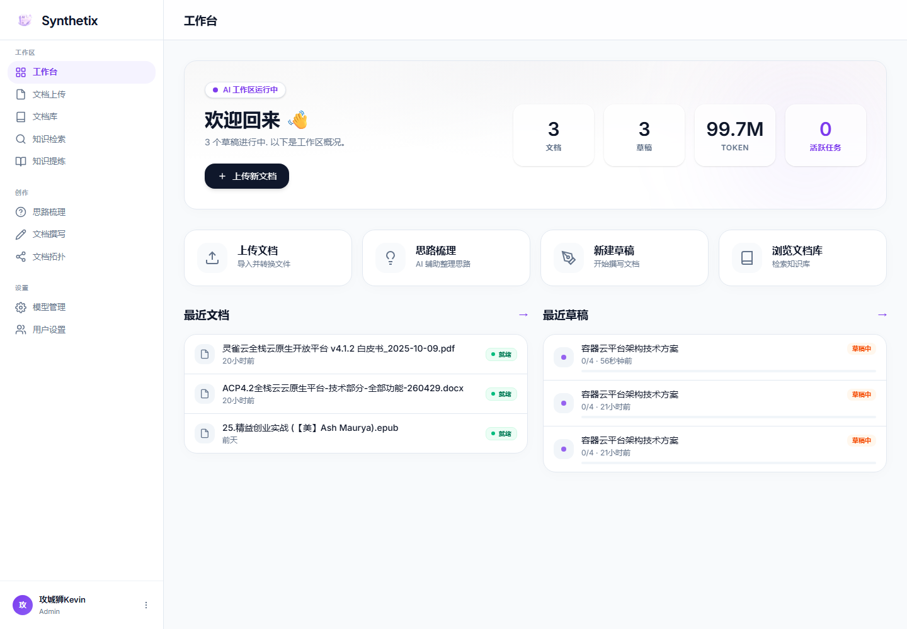

## Synthetix 是什么？

Synthetix 是一个自托管 AI 工作台，面向需要把大批量源文档转化为结构化、可追溯长文档的用户。

它适用于研究报告、技术方案、咨询文档、产品与项目文档等严肃写作场景：源材料通常远超一次 AI 对话的上下文窗口，而最终文档又必须跨多个章节保持连贯。

Synthetix 不会把你的文件当成一次性附件，而是将它们转换为分层知识库，再基于这套知识库支持搜索、Wiki 综合、图谱探索、引导式大纲、逐章节写作、模型对比、来源引用、拓扑分析和导出。

## 为什么需要 Synthetix？

通用 AI 对话工具和基础 RAG 应用很有用，但一旦用于严肃文档生产，通常会遇到三个问题：

1. **大规模源材料超过单次模型上下文。** 一份上百页规范、一组报告，或一个私有知识库，都无法可靠地塞进一个 prompt。
2. **生成内容缺乏可检查的来源追踪。** 专业写作必须回答：这个章节由哪些文档支撑？这个论断来自哪里？
3. **传统 RAG 不会积累知识。** 它会一次又一次检索 chunk，但系统不会随着使用沉淀出可复用、可读的人类知识理解。

Synthetix 正是围绕这些问题构建的。它结合三层知识架构、基于 Wiki 的知识飞轮，以及有状态写作流程，让长文档能够基于持久知识库生成、审阅、追溯、修订和导出。

## 目录

- [截图](#截图)
- [核心工作流](#核心工作流)
- [差异化在哪里？](#差异化在哪里)
- [支持格式](#支持格式)
- [模型与后端灵活性](#模型与后端灵活性)
- [知识图谱推荐嵌入模型](#知识图谱推荐嵌入模型)
- [快速开始](#快速开始)
- [首次跑通流程](#首次跑通流程)
- [配置](#配置)
- [工作原理](#工作原理)
- [当前状态与限制](#当前状态与限制)
- [文档](#文档)
- [开发](#开发)
- [贡献](#贡献)
- [安全与隐私](#安全与隐私)
- [许可证](#许可证)

## 截图

下面是主要产品界面的快速导览，均截取自本地自托管工作台。

<details open>
<summary>工作台首页</summary>


工作台总览：文档状态、草稿状态、Token 用量，以及上传、头脑风暴、写作和文档库入口。
</details>

<details>
<summary>文档库</summary>

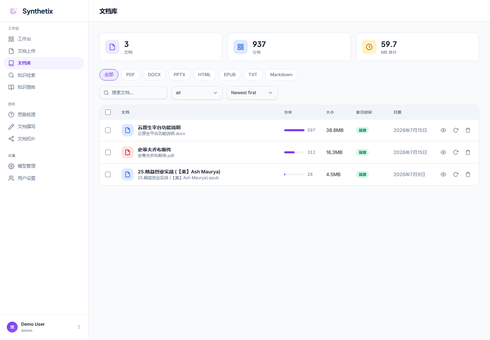

已上传文档、处理状态、元数据，以及文档库级管理。
</details>

<details>
<summary>知识搜索</summary>

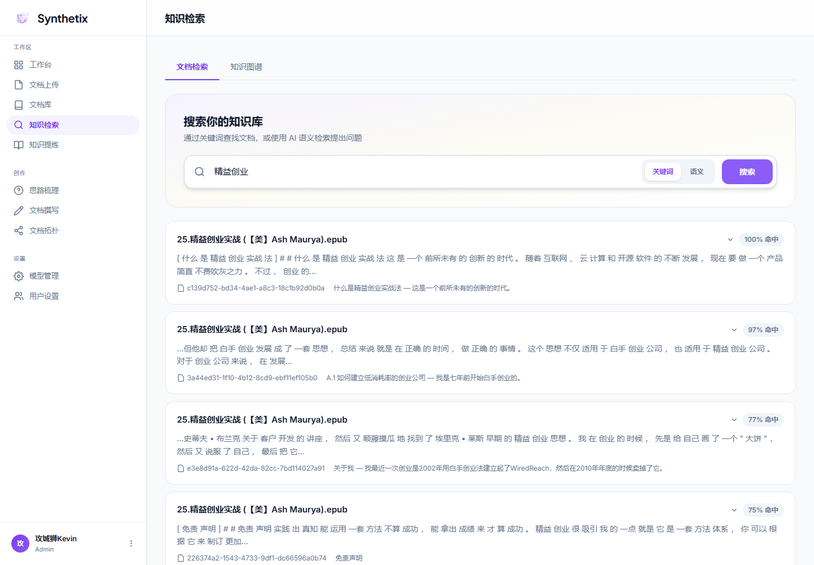

对已索引文档块进行关键词和语义搜索，带相关度分数和来源预览。
</details>

<details>
<summary>知识图谱</summary>

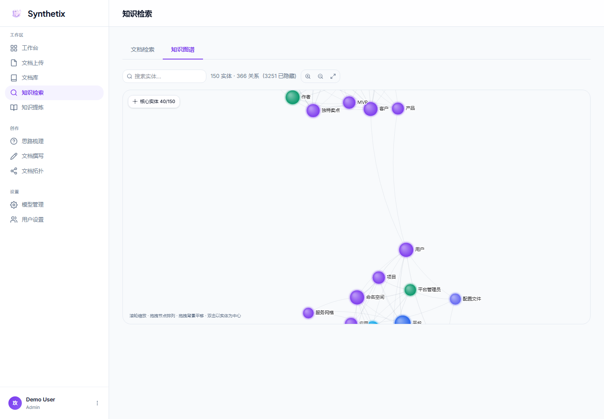

LightRAG 抽取的实体与关系的力导向图——直观检查整个文档语料中的概念结构与关联。
</details>

<details>
<summary>知识 Wiki</summary>

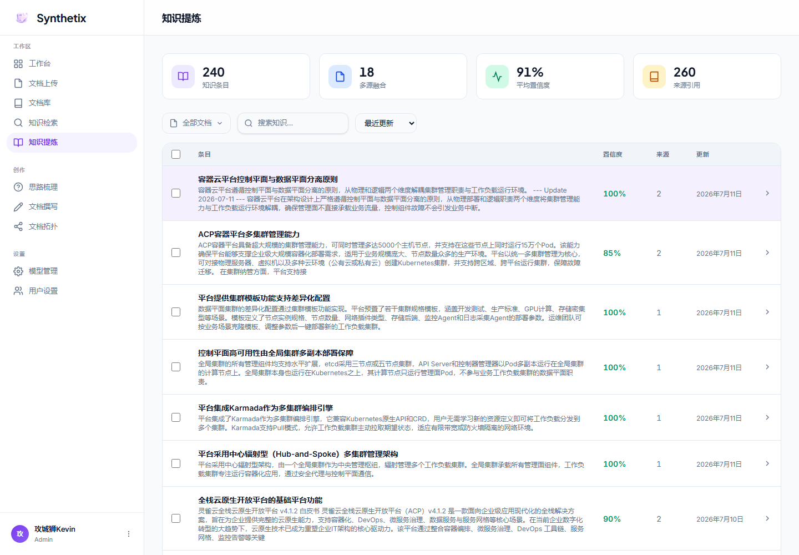

LLM 综合生成的知识条目，带置信度、来源数量，支持搜索、筛选、编辑和导出。
</details>

<details>
<summary>头脑风暴</summary>

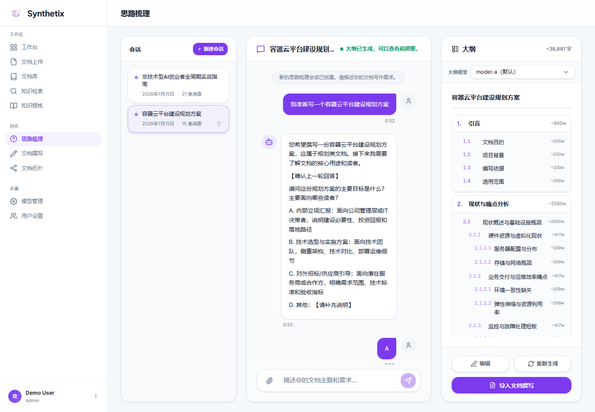

引导式头脑风暴流程，在开始写作前澄清目标、范围、受众和文档形态。
</details>

<details>
<summary>写作工作台</summary>

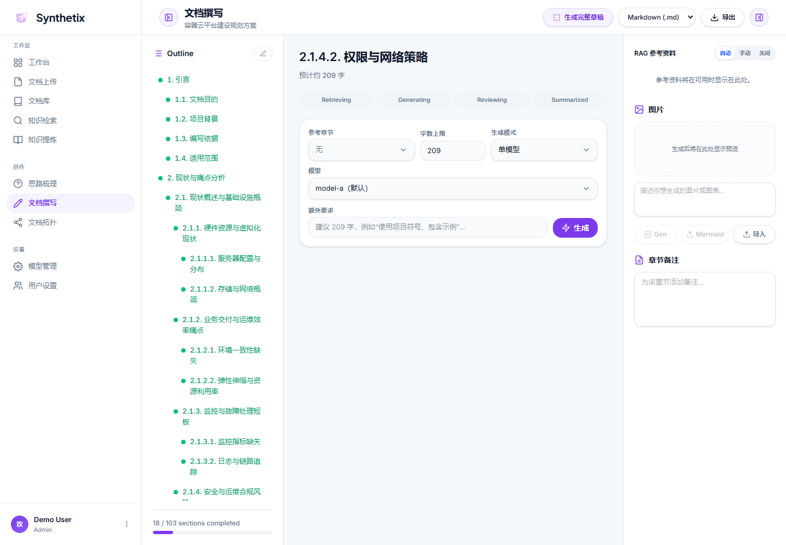

逐章节写作，结合大纲上下文、生成状态、引用、模型对比、版本和导出。
</details>

<details>
<summary>文档拓扑</summary>

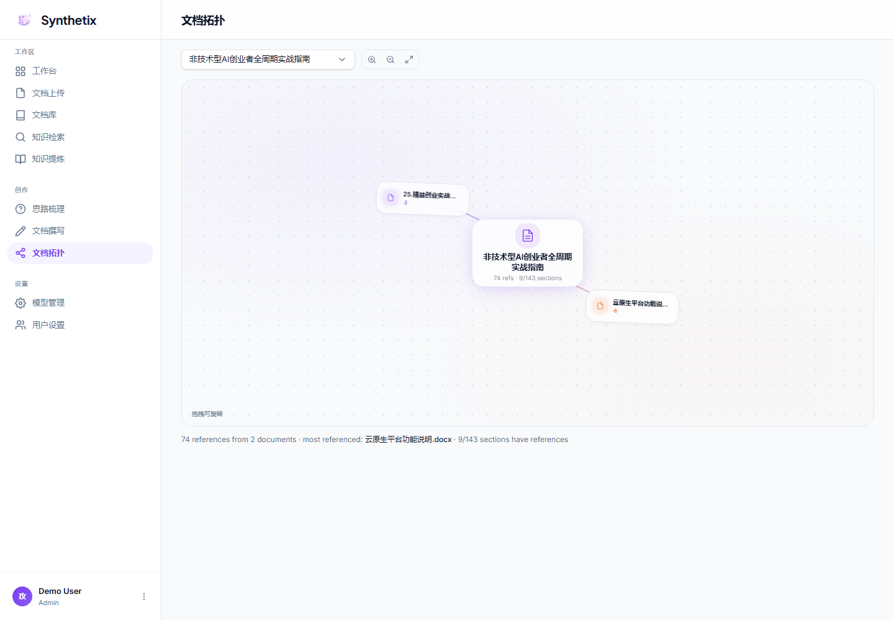

力导向拓扑视图，把生成章节映射到支撑它们的已上传文档。
</details>

<details>
<summary>模型用量统计</summary>

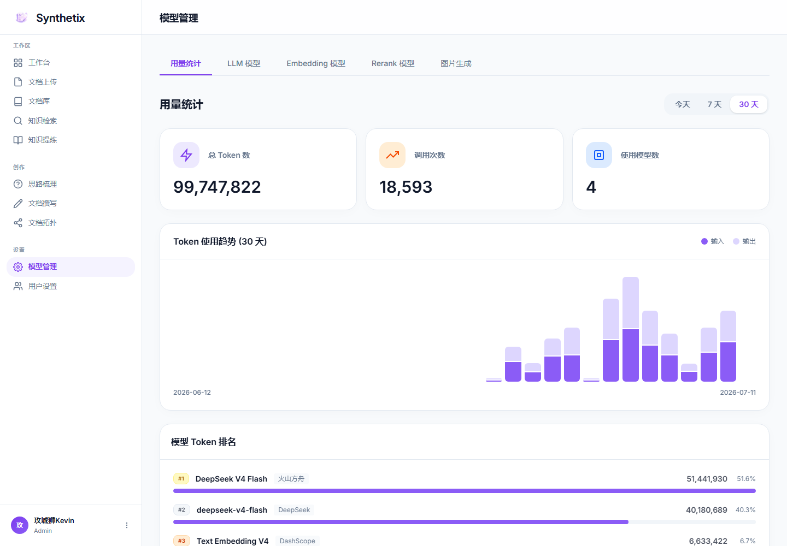

Token 用量总览，含汇总卡片、趋势图、模型用量排名和按模块（头脑风暴、写作等）的用量分解。
</details>

## 核心工作流

### 1. 建立知识库

上传支持的文档，并将它们转成可搜索、可复用的知识库。

- 支持格式：**PDF、DOCX、PPTX、HTML、EPUB、TXT、Markdown/MD**。
- 文档会被转换为 Markdown，拆分为结构化 chunks，生成 embedding，并建立全文检索与语义检索索引。
- Synthetix 使用结构感知拆分、本地语义微拆分、面包屑上下文和 LLM 引导的领域分段，为不同知识层准备不同粒度的输入。
- LightRAG 图谱索引和 Wiki 综合会作为后台增强运行，因此文档可以在所有增强层完成前先变得可用。

### 2. 探索知识

Synthetix 不只是写作工具，也是知识探索工作台。

- **关键词搜索**使用 SQLite FTS5，并支持中文分词。
- **语义搜索**结合 LightRAG 检索、直接 embedding 回退、关键词检索和结果融合。
- **LightRAG 检索模式**包括 `local`、`global`、`hybrid`、`mix`、`naive`、`bypass`；其中 `mix` 模式结合图、向量和 reranker 风格检索。
- **知识图谱探索**支持浏览抽取出的实体、关系、图邻域和证据。
- **知识 Wiki**支持浏览、搜索、编辑和导出综合条目，每条带来源、置信度、链接、反向链接和变更历史。

### 3. 撰写长文档

Synthetix 面向多章节写作，而不是一次性回答。

- 从引导式头脑风暴开始，澄清目标、范围、受众和文档形态。
- 生成可编辑、可重组的递归大纲。
- 逐章节生成正文，每个章节都基于知识库检索上下文。
- 章节 prompt 会结合大纲位置、父/兄弟/子节点、已完成章节摘要、Wiki 条目、RAG 引用和图谱引用。
- 可以用相同上下文让两个模型进行 A/B 生成，并排对比后选择更优版本。
- 支持确认版本、回滚历史版本，并将最终草稿导出为 Markdown、PDF 或 DOCX。

### 4. 检查来源覆盖

专业写作不只要问“写得好不好”，还要问“由什么支撑”。

- 章节引用会持久化来源文档、chunk、来源类型、相关度分数和支撑内容。
- 引用面板区分原始 RAG chunks、图谱引用和 Wiki 条目。
- 文档拓扑视图展示哪些上传文档支撑了哪些生成章节，并提供覆盖率、引用次数和最常引用来源等统计。

## 差异化在哪里？

### 三层知识架构

大多数 RAG 系统停留在切块和向量相似度。Synthetix 将知识拆成三层，因为每一层解决的问题不同。

| 层 | 作用 | 为什么重要 |
| --- | --- | --- |
| **原始文档块** | 带 embedding 和全文索引的逐字文档片段 | 保留可追溯、可检查的证据。 |
| **LightRAG 实体图谱** | 从语料中用 LLM 抽取实体和关系 | 捕捉扁平向量检索容易遗漏的概念与关联。 |
| **LLM 知识 Wiki** | 人类可读的综合条目：文档摘要、主题、概念和论断 | 把重复检索转成可复用知识，可检查、可编辑、可链接、可导出。 |

这让 Synthetix 能同时利用证据、关系和综合知识，而不是用一种检索方式处理所有任务。

### 知识飞轮

传统 RAG 的常见弱点是每次查询都从原始检索重新开始。Synthetix 增加了基于 Wiki 的飞轮：

```text
文档
  -> chunks、图谱和 Wiki 条目
  -> 写作时优先查询 Wiki
  -> 当 Wiki 覆盖良好时减少原始检索量
  -> 生成章节后将新知识回写 Wiki
  -> 被引用的条目提升置信度
  -> 未来检索从更丰富的知识库开始
```

结果是知识库会随着写作变得更有用。Wiki 不只是缓存，而是用户可以检查和编辑的可读综合层。

### 可追溯写作工作台

Synthetix 把长文写作视为一个流程，而不是一条聊天消息。

它在头脑风暴、大纲、草稿章节、模型对比、引用、章节版本、拓扑分析和导出之间保留状态。每个章节都可以用自己的目标上下文生成，同时又遵循周围大纲结构和已完成章节内容。

## 支持格式

Synthetix 当前支持面向文本处理的文档格式：

| 格式 | 扩展名 |
| --- | --- |
| PDF | `.pdf` |
| Word | `.docx` |
| PowerPoint | `.pptx` |
| HTML | `.html` |
| EPUB | `.epub` |
| Plain text | `.txt` |
| Markdown | `.md` |

表格类格式未列入当前文档写作管线的支持范围。

## 模型与后端灵活性

Synthetix 被设计为可搭配多种模型和检索后端使用。

| 领域 | 支持 / 规划选项 |
| --- | --- |
| LLM Provider | OpenAI 兼容端点、Anthropic、Ollama |
| 本地模型 | 适用场景下的 Ollama 兼容本地服务 |
| 主数据库 | 默认 SQLite；PostgreSQL 路径为未来云端/团队部署准备 |
| LightRAG 存储 | 默认本地 JSON/NanoVectorDB/NetworkX；可配置 PostgreSQL/pgvector、Neo4j、Milvus、Qdrant |
| 桌面运行时 | Windows Electron 安装包和源码开发运行方式 |

系统是否完全离线取决于你配置的模型 provider。如果使用远程 LLM 或 embedding provider，相关内容会发送给该 provider 处理；如果使用本地 provider，更多流程可以留在自己的机器上。

## 知识图谱推荐嵌入模型

知识图谱和完整分析模式使用 LightRAG 进行实体/关系抽取，要求嵌入模型**至少 1536 维**。维度不足的模型（如 768、1024 维）会静默禁用图谱模式并回退到基础检索。下表汇总了满足或超过该阈值的云端嵌入模型，方便你在需要图谱增强检索时选择合适的服务。

| 模型 | 提供商 | 维度 | 访问地址 | 备注 |
| --- | --- | --- | --- | --- |
| text-embedding-3-large | OpenAI | 3072 | [openai.com](https://openai.com) | 支持降维 |
| text-embedding-3-small | OpenAI | 1536 | [openai.com](https://openai.com) | 性价比款 |
| text-embedding-ada-002 | OpenAI | 1536 | [openai.com](https://openai.com) | 早期经典款 |
| Gemini Embedding 2 | Google | 3072 | [ai.google.dev](https://ai.google.dev) | 多模态，支持降维 |
| Nova Multimodal Embeddings | Amazon | 3072 | [aws.amazon.com/bedrock](https://aws.amazon.com/bedrock) | 多模态 |
| solar-embedding-1-large | Upstage | 4096 | [upstage.ai](https://upstage.ai) | |
| text-embedding-v4 | 阿里云 | 最高 2048 | [aliyun.com](https://aliyun.com) | 可选 1536/1024 等 |
| qwen3-vl-embedding | 阿里云 | 最高 2560 | [aliyun.com](https://aliyun.com) | 多模态 |
| Qwen3-Embedding-8B | 阿里云（开源） | 最高 4096 | [aliyun.com](https://aliyun.com) | 支持自定义 |
| gte-Qwen2-7B-instruct | 阿里云（开源） | 3584 | [aliyun.com](https://aliyun.com) | |
| Doubao-embedding-large | 字节跳动 | 2048 | [volcengine.com](https://volcengine.com) | 可降维 |
| Seed1.6-Embedding | 字节跳动 | 2048 | [volcengine.com](https://volcengine.com) | |
| Embedding-3 | 智谱 AI | 最高 2048 | [open.bigmodel.cn](https://open.bigmodel.cn) | 支持自定义 |
| kinfra-text-embedding-4b | 腾讯云 | 2560 | [cloud.tencent.com](https://cloud.tencent.com) | 固定维度 |
| KaLM-Embedding | 腾讯（开源） | 3840/2048 | [cloud.tencent.com](https://cloud.tencent.com) | 支持多层级 |
| Piccolo2 | 商汤科技 | 1792 | [sensetime.com](https://sensetime.com) | |
| jina-embeddings-v4 | Jina AI | 2048 | [jina.ai](https://jina.ai) | 多模态 |
| voyage-4 系列 | Voyage AI | 最高 2048 | [voyageai.com](https://voyageai.com) | 支持降维 |
| pplx-embed-v1-4b | Perplexity | 2560 | [docs.perplexity.ai](https://docs.perplexity.ai) | |
| zembed-1 | ZeroEntropy | 2560 | [zeroentropy.dev](https://zeroentropy.dev) | |
| embed-v4 | Cohere | 1536 | [cohere.com](https://cohere.com) | 刚好"踩线" |
| voyage-large-2 | Voyage AI | 1536 | [voyageai.com](https://voyageai.com) | 刚好"踩线" |

> **提示**：在模型管理中添加嵌入模型时，如果检测到的维度低于 1536 会显示警告。文档处理页面也会对低维模型禁用知识图谱/完整分析选项。配置上表中的任意模型即可启用图谱增强检索。

## 快速开始

### 方式 A：Windows 安装包

从 [GitHub Releases](https://github.com/WalkCloud/Synthetix/releases) 下载最新 `.exe` 安装包，安装后从开始菜单启动 Synthetix。

### 方式 B：从源码运行

前置要求：

- Node.js 24.18.0 (supported range: `>=24.18.0 <25`)
- pnpm 11.15.0
- Python 3.14.6（开发解释器与安装包内 sidecar 使用同一版本）
- 开发或运行 macOS 桌面版需要 macOS 12+（Monterey 或更高版本）
- OpenAI 兼容、Anthropic、DeepSeek 兼容或 Ollama 端点

```bash
git clone https://github.com/WalkCloud/Synthetix.git
cd Synthetix

npm install
copy .env.example .env

npx prisma migrate dev
npx prisma generate

npm run dev
```

打开 `http://localhost:3000`，创建第一个管理员账号，在设置里添加模型 Provider，然后上传文档。

偏好 pnpm？仓库自带 `pnpm-lock.yaml`，`pnpm install` 同样可用。

## 首次跑通流程

启动应用后，建议按这个流程体验核心价值：

1. **添加模型 Provider**：在设置里配置至少一个支持聊天的模型和一个支持 embedding 的模型。
2. **上传支持格式的文档**：例如 PDF、DOCX、PPTX、HTML、EPUB、TXT 或 Markdown。
3. **处理并索引文档**：生成 chunks、embedding、全文检索和后台知识增强。
4. **检查知识库**：打开 Search、Knowledge Wiki 或 Knowledge Graph。
5. **开始头脑风暴**：澄清你想写的文档。
6. **生成并编辑大纲**，然后创建草稿。
7. **生成一个章节**，检查引用，需要时进行模型对比，然后确认版本。
8. **打开拓扑视图**，查看哪些来源文档支撑了草稿。

## 配置

把 `.env.example` 复制为 `.env`，至少设置：

| 变量 | 用途 |
| --- | --- |
| `JWT_SECRET` | 签发访问令牌和刷新令牌，建议使用强随机值。 |
| `NEXT_PUBLIC_APP_URL` | 应用访问地址，本地通常是 `http://localhost:3000`。 |

如果 Python 解释器没有被自动识别，用 `PYTHON_PATH` 指定。

模型 Provider 在应用 UI 中配置。数据库路径、处理并发、可选 LightRAG 后端等完整配置都在 [`.env.example`](./.env.example) 中有注释说明。

## 工作原理

### 知识与写作流程

```text
文档
  -> Markdown 转换
  -> 结构化 chunks + embedding + 全文索引
  -> LightRAG 图谱索引
  -> LLM Wiki 综合
  -> Wiki 优先 / RAG / 图谱感知的上下文组装
  -> 章节生成、模型对比、引用、版本
  -> 拓扑分析和导出
```

### 系统栈

```text
Browser
  React, Tailwind CSS, shadcn/ui, d3-force
        |
Next.js App Router
  页面、API、认证、设置、任务队列
        |
Prisma + SQLite
        |
Python workers
  转换、语义分块、LightRAG 索引、导出
        |
LLM providers
  OpenAI 兼容、Anthropic、DeepSeek 兼容、Ollama、本地服务
```

### 关键目录

| 路径 | 用途 |
| --- | --- |
| `src/app` | Next.js 页面和 API 路由。 |
| `src/lib/documents` | 文档生命周期、转换、分段、分块、索引和存储。 |
| `src/lib/rag` | 连接 LightRAG 图谱与查询 worker 的 TypeScript 层。 |
| `src/lib/wiki` | Wiki 综合、查询、合并、链接、变更日志和导出。 |
| `src/lib/search` | 关键词、语义、LightRAG、直接 embedding 和融合检索。 |
| `src/lib/writing` | 头脑风暴、大纲、上下文组装、章节生成、模型对比、引用、拓扑、导出。 |
| `workers/python` | 转换、分块、LightRAG 索引/查询/管理、导出 worker。 |
| `electron`, `packaging` | 桌面端外壳和 Windows 安装包脚本。 |

## 当前状态与限制

- 图谱索引和 Wiki 综合是后台增强。文档可以在所有增强层完成前先变得可用。
- 完全离线 AI 取决于本地模型 provider。远程模型 provider 会接收执行对应任务所需的内容。
- 当前文档写作管线不支持表格类格式。
- 文本抽取和知识生成是重点；源文档图片、表格和版式的高保真复现不是当前主要目标。
- 云同步、远端对象存储和远端向量/数据库后端是 cloud-ready 方向的一部分，但不是今天默认的本地流程。

## 文档

- [发版流程](docs/release-workflow.md)
- [更新日志](CHANGELOG.md)

## 开发

```bash
npm run dev
npm run build
npm run lint
npm test
npm run test:run
npm run e2e
```

Prisma：

```bash
npx prisma generate
npx prisma migrate dev --name <change>
npx prisma studio
```

## 贡献

欢迎提交 Issue 和 Pull Request。较大的改动建议先开 Issue 讨论方案，再开始实现。

适合首次贡献的方向：

- 安装和部署文档
- Provider 兼容性修复
- API、worker、写作流程、导出和更新路径测试
- 无障碍和 UI 打磨
- 模型/Provider 配置与故障排查文档

请保持改动聚焦，并尽可能附带测试或验证说明。

## 安全与隐私

Synthetix 面向自托管和离线优先工作流，但数据边界取决于你的部署方式和模型配置。

- 上传文件和应用数据会按你的本地或已配置后端存储。
- 如果配置远程 LLM、embedding、rerank 或图像 provider，相关内容会发送给这些 provider 处理。
- 使用 Ollama 兼容本地服务等本地 provider 可以减少外部数据传输。
- 未来 cloud-ready 存储和数据库后端将作为可选能力，而不是替代本地/自托管工作流。

## 许可证

Synthetix 使用 [Apache License 2.0](LICENSE)。第三方开源声明可在应用内通过 **About → Third-party notices** 查看。
