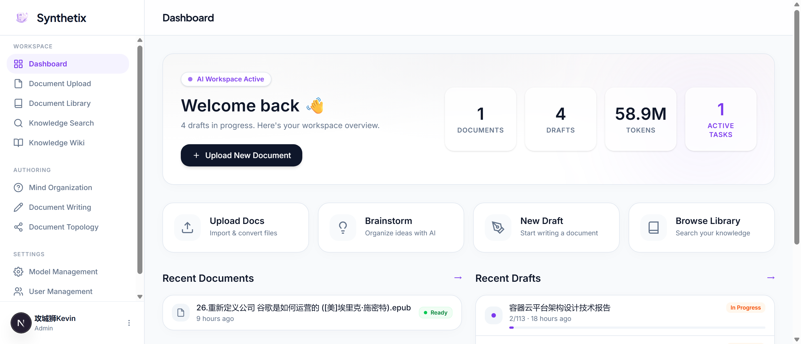
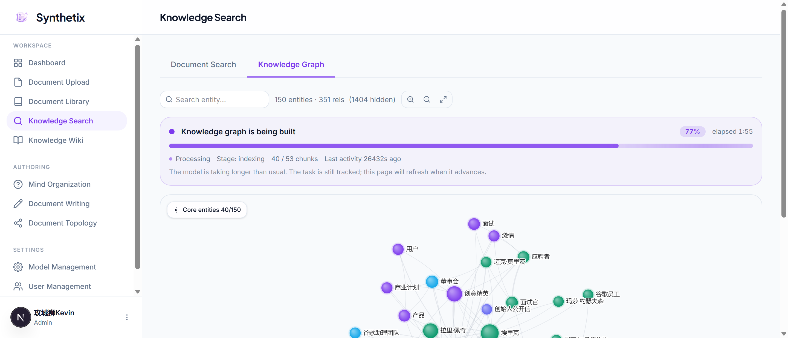
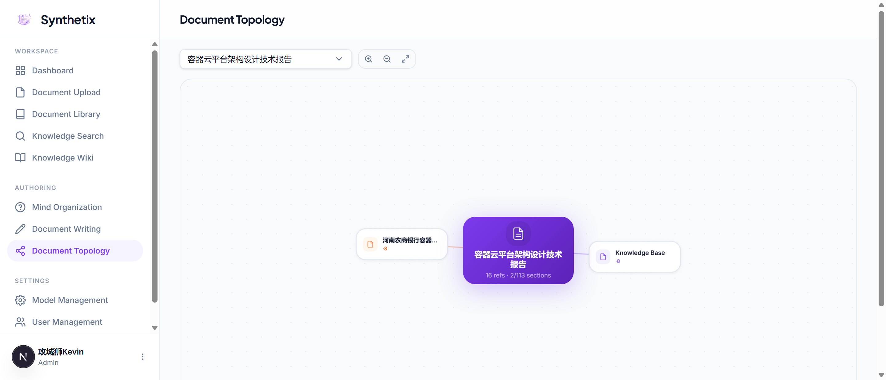
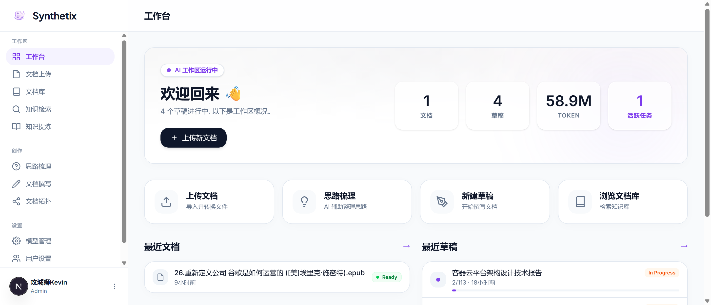
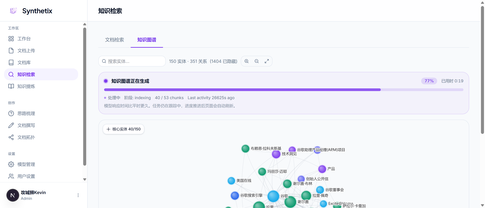
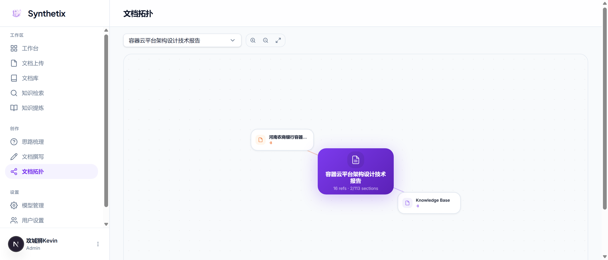

# Synthetix

English | [简体中文](#简体中文)

> **TL;DR** — Self-hostable AI workbench that turns thousand-page documents into searchable knowledge, then writes professional long-form drafts section by section with RAG + Wiki + knowledge graph context. Local-first, multi-provider, bilingual.

## Contents

- [Why Synthetix exists](#why-synthetix-exists)
- [Who it is for](#who-it-is-for)
- [Core advantages](#core-advantages)
- [How it works](#how-it-works)
- [Product capabilities](#product-capabilities)
- [Quick start](#quick-start)
- [Configuration](#configuration)
- [Architecture](#architecture)
- [Tech stack](#tech-stack)
- [Project structure](#project-structure)
- [Development](#development)
- [Releases](#releases)
- [Roadmap](#roadmap)
- [Contributing](#contributing)
- [License](#license)

<p align="center">
  
</p>

<p align="center">
  <strong>An AI document system for ultra-large document processing and long professional document writing beyond LLM context windows.</strong>
</p>

<p align="center">
  <a href="./LICENSE"></a>
  
  
  
  
</p>

Synthetix is built for work that does not fit inside a single LLM request: thousand-page documents, large private knowledge collections, repeated retrieval and questioning, and professional drafts that may reach hundreds of thousands of words.

Instead of sending an entire corpus to a model at once, Synthetix converts source files into structured, searchable, reusable knowledge. It combines document conversion, semantic segmentation, RAG, knowledge graph extraction, an LLM Wiki layer, recursive outlines, section-by-section writing, model comparison, version rollback, and Markdown/PDF/DOCX export in one local-first system.

### ✨ Key features at a glance

| | Feature | What it does |
|---|---|---|
| 📄 | **Multi-format ingestion** | PDF, DOCX, PPTX, XLSX, EPUB, HTML, TXT, CSV, Markdown → searchable Markdown + chunks |
| 🧠 | **LLM Wiki synthesis** | Auto-extracts summaries, topics, concepts, and claims into a browsable knowledge base |
| 🔗 | **Knowledge graph** | LightRAG + d3-force entity-relationship visualization across your corpus |
| ✍️ | **Section writing studio** | Recursive outlines, streaming generation, A/B model compare, version rollback, RAG context |
| 🎯 | **Multi-provider routing** | Separate models for writing / embedding / rerank / graph / image — switch any time |
| 🔒 | **Local-first & encrypted** | SQLite + AES-256 API key encryption + self-hosted, no cloud lock-in |
| 🌐 | **Bilingual UI** | English and Simplified Chinese, synced across interface, prompts, and errors |

<details>
<summary><b>📖 Screenshot — Dashboard overview</b></summary>



*The dashboard shows document count, drafts in progress, token usage, and active background tasks at a glance.*
</details>

## Why Synthetix exists

LLM context windows keep getting larger. That helps, but it does not remove the core limit.

Even a 1M-token context is still small compared with a 1000+ page document set, a long-running knowledge library, or a professional deliverable that needs hundreds of thousands of words. Long-context models also do not automatically provide persistent knowledge, reusable summaries, document-level topic extraction, section state, version history, or a practical way to keep very long drafts coherent.

Synthetix solves this by changing the unit of work:

- large documents are converted into Markdown, atoms, segments, chunks, embeddings, graph entities, and Wiki knowledge entries
- retrieval, graph context, and Wiki knowledge are used to support writing instead of forcing the model to rediscover the same material repeatedly
- long documents are written through recursive outlines and section states, with previous section summaries carried forward
- users can browse the extracted knowledge, inspect document relationships, compare model outputs, and revise before export

## Who it is for

Synthetix is for people who work with large source material and need professional output, not short chat answers:

- researchers and analysts working with long reports, papers, policies, manuals, standards, or technical references
- consultants, solution architects, and proposal teams producing long-form professional documents
- product, engineering, legal, operations, and enterprise knowledge teams managing private document collections
- users who need local-first processing for internal or sensitive documents
- teams that want LLM-assisted writing without turning every large document into a fragile one-time model request

## Core advantages

| Advantage | What it means |
| --- | --- |
| Built beyond context windows | Synthetix assumes important documents will exceed model context. It processes large text into durable knowledge layers and writes output section by section. |
| Ultra-large document processing | PDF, DOCX, PPTX, XLSX, Markdown, EPUB, HTML, TXT, and CSV files are converted, segmented, indexed, and prepared for retrieval and writing. |
| LLM Wiki knowledge extraction | The Wiki layer extracts document summaries, topics, concepts, and claims so users can quickly find the knowledge they care about inside large documents. |
| Professional long-document writing | Recursive outlines, section generation, previous-section summaries, user constraints, model comparison, version rollback, and export make very long documents manageable. |
| Reference-informed generation | RAG and Wiki context help the model write with richer domain knowledge and fewer missing details. Document association records show which documents and knowledge entries influenced a section. |
| Knowledge graph exploration | LightRAG and `d3-force` expose entities and relationships across the corpus, helping users understand how concepts, documents, and sections connect. |
| Separate strategies for Wiki and graph | Wiki uses larger semantic segments for knowledge synthesis; graph extraction uses smaller contextual chunks to preserve entity and relationship quality. |
| Model-by-capability routing | Configure different providers and models for writing, embeddings, reranking, graph extraction, image tasks, and local services. |
| Local-first and self-hostable | SQLite, local files, encrypted API keys, Python workers, and Windows desktop packaging keep private material under user control. |
| Bilingual product surface | English and Simplified Chinese UI, model instructions, and API errors are maintained together. |

## How it works

```text
Upload source documents
  -> Convert to Markdown
  -> Build atoms, segments, chunks, embeddings, graph data, and Wiki entries
  -> Browse, search, and query the extracted knowledge
  -> Brainstorm and generate a recursive outline
  -> Write section by section with RAG and Wiki context
  -> Compare model outputs, edit, confirm, and summarize sections
  -> Export Markdown, PDF, or DOCX
```

## Product capabilities

### Document library

Upload and manage large source documents in a searchable library. Synthetix converts files to Markdown, extracts structure, stores metadata, tracks processing status, and supports previews, tags, keyword search, semantic search, and reprocessing.

The conversion worker supports PDF, DOCX, PPTX, XLSX, Markdown, EPUB, HTML, TXT, and CSV processing paths.

### Large-document processing

Large documents are not treated as bigger strings. Synthetix builds multiple representations for different jobs:

- document atoms preserve locatable structure and stable boundaries
- semantic segments represent larger topics and domains for synthesis
- chunks support embeddings, full-text search, and RAG retrieval
- contextual graph chunks improve entity and relationship extraction
- Wiki entries preserve synthesized knowledge for later browsing, querying, and writing

### Knowledge modes

Users choose the processing depth without needing to manage chunk sizes, graph indexes, embedding dimensions, or worker details.

| Mode | Best for | What it builds |
| --- | --- | --- |
| Standard | Fast ingest and retrieval | Markdown, chunks, embeddings, FTS, and semantic retrieval |
| Graph | Relationship-heavy material | Standard mode plus entity and relationship graph extraction |
| Wiki | Knowledge extraction and browsing | Standard mode plus summaries, topics, concepts, and claims |
| Full | Serious long-document writing | Graph and Wiki together for richer retrieval, knowledge discovery, and writing context |

### LLM Wiki knowledge layer

The Wiki layer is not a side panel for references. Its main job is to turn large documents into reusable knowledge that users can inspect and query.

For each processed document, Synthetix can synthesize:

- document-level summaries that help users understand what a source contains
- topics that group important knowledge areas
- concepts that explain domain terms and mechanisms
- claims that capture important assertions, decisions, requirements, or constraints
- typed links between related knowledge entries

This makes it easier to open a 1000-page document and quickly reach the parts that matter: a topic, a concept, a requirement, a technical decision, or a repeated theme. During writing, Wiki entries provide organized professional context so the model can write with better coverage and domain continuity.

The Wiki pipeline is designed for large documents. It processes chunks or segments incrementally, builds micro-summaries, reduces them into document-level knowledge, and updates the knowledge layer without requiring the model to read the entire document in one request.

### RAG and knowledge graph

Synthetix uses LightRAG workers for indexing, querying, and graph management. The graph view lets users search entities, inspect relationships, and understand how concepts are connected across documents.

Graph extraction is an enhancement layer. Basic retrieval can become available first, while heavier graph and Wiki work continues in the background.

<details>
<summary><b>📖 Screenshot — Knowledge graph explorer</b></summary>



*Force-directed graph (d3-force) visualizes entities and relationships extracted by LightRAG across the document corpus.*
</details>

### Brainstorming and recursive outlines

Before writing, Synthetix helps clarify the document goal, audience, structure, length, document type, and reference scope. It then turns the conversation into an editable recursive outline.

Long sections can be expanded into child sections, so a very large document can be planned at the correct granularity before generation starts.

### Section writing studio

Drafts are generated section by section. For each section, Synthetix rewrites retrieval queries, gathers Wiki and RAG context, applies user constraints, streams generated content, records document associations, and moves the section through a review lifecycle.

You can:

- generate one section or continue through the full draft
- compare two model outputs side by side
- edit the selected version before confirming it
- roll back to previous section versions
- generate section summaries for later continuity
- add Mermaid/SVG diagrams and image assets
- continue writing when a non-critical retrieval enhancement fails

This is what makes ultra-long generated documents practical. The model does not need to hold the final document in memory. Synthetix keeps the outline, selected content, previous section summaries, associated references, versions, and review state in the application.

### Document topology

The topology view shows how sections, reference documents, and generated content relate to each other after writing begins. It is useful when a draft grows large enough that its structure and document relationships are hard to track manually.

<details>
<summary><b>📖 Screenshot — Document topology</b></summary>



*The topology view reveals how sections, reference documents, and generated content interconnect as a draft grows.*
</details>

### Model management

Synthetix stores provider configuration in the app and encrypts API keys at rest with AES-256-GCM. Database credentials (for optional PostgreSQL) are separately encrypted with AES-256-CBC. It supports provider testing, model capability tags, default model slots, token usage recording, cost estimates, and usage trends.

Supported provider styles include Ollama, OpenAI-compatible endpoints, Anthropic, DeepSeek-compatible endpoints, and local services.

The LLM layer includes an adaptive per-provider concurrency limiter shared by Node and Python workers. It reacts to latency, rate-limit headers, and `429` responses to keep multi-provider workflows stable under load.

### Desktop and self-hosted deployment

Synthetix runs as a local Next.js application and includes Electron/Inno Setup packaging for Windows. The packaged desktop build reduces setup work for users who do not want to assemble the runtime manually.

## Quick start

### Prerequisites

| Requirement | Version | Notes |
| --- | --- | --- |
| **Node.js** | 20+ | LTS recommended (22/24 tested). |
| **Python** | 3.13+ | For document conversion, RAG, chunking, graph, Wiki, and export workers. |
| **pnpm** | latest | The maintained install path (lockfile included). `npm` also works. |
| **LLM provider** | — | Any OpenAI-compatible, Anthropic, DeepSeek-compatible, or Ollama endpoint. |

### Option A — Windows desktop installer (no build tools needed)

Download the latest `.exe` installer from [GitHub Releases](https://github.com/WalkCloud/Synthetix/releases), run it, and launch Synthetix from the Start Menu. Python runtime is bundled.

### Option B — Run from source

```bash
# 1. Clone
git clone https://github.com/WalkCloud/Synthetix.git
cd Synthetix

# 2. Install dependencies
pnpm install

# 3. Configure environment
cp .env.example .env
# Edit .env — set JWT_SECRET and ENCRYPTION_KEY (see Configuration below)

# 4. Initialize database
npx prisma migrate dev
npx prisma generate

# 5. Start the dev server
pnpm dev
```

Open **http://localhost:3000**. On first launch:
1. **Create the admin account** — the setup page appears automatically.
2. **Add a model provider** — go to Settings → Model Management, enter your API key and endpoint.
3. **Upload a document** — go to Document Upload, drop a PDF/DOCX, and watch it process.
4. **Start writing** — go to Mind Organization to brainstorm, or Document Writing to start a draft.

<details>
<summary>🔧 Troubleshooting common setup issues</summary>

| Problem | Solution |
| --- | --- |
| `pnpm install` fails on `better-sqlite3` / `electron` builds | Run `pnpm approve-builds` to allow native build scripts, then retry. |
| Python worker errors (`ModuleNotFoundError`) | Ensure Python 3.13+ is on PATH. Install worker deps: `pip install -r workers/python/requirements.txt`. |
| `ENCRYPTION_KEY` or `JWT_SECRET` missing | These are **required** — generate with `openssl rand -hex 32` and set in `.env`. |
| Port 3000 already in use | Set `PORT=3001` in `.env` or kill the process on port 3000. |
| Document conversion hangs | Check `CONVERTER_TIMEOUT_MS` (default 5 min). For very large PDFs, increase it. |
</details>

## Configuration

Copy `.env.example` to `.env` before starting the app.

### Required secrets

| Variable | Description |
| --- | --- |
| `JWT_SECRET` | Secret used to sign access and refresh tokens. Use a random 32-character value or stronger. |
| `ENCRYPTION_KEY` | 32-character AES-256-GCM key used to encrypt provider API keys. |

### Common application settings

| Variable | Default | Description |
| --- | --- | --- |
| `DB_PATH` | `%USERPROFILE%/synthetix-data/dev.db` | SQLite database location. |
| `JWT_ACCESS_EXPIRES` | `15m` | Access token lifetime. |
| `JWT_REFRESH_EXPIRES` | `7d` | Refresh token lifetime. |
| `PYTHON_PATH` | `python` on Windows, `python3` elsewhere | Python interpreter used by workers. |
| `NEXT_PUBLIC_APP_NAME` | `Synthetix` | Application name shown in the UI. |
| `NEXT_PUBLIC_APP_URL` | `http://localhost:3000` | Public app URL. |

### Document processing and performance

| Variable | Default | Description |
| --- | --- | --- |
| `PYTHON_DAEMON_ENABLED` | `true` | Keeps ONNX chunking and LightRAG workers warm to avoid repeated cold starts. |
| `DOC_PHASE1_CONCURRENCY` | `1` | Maximum concurrent conversion and chunking jobs. |
| `PYTHON_THREAD_LIMIT` | `2` | Per Python subprocess thread cap for CPU-heavy libraries. |
| `CONVERT_SKIP_IMAGES` | `true` | Skips image extraction during conversion for faster text-first indexing. |
| `LOCAL_EMBED_MODEL_PATH` | `data/models/gte-multilingual-base` | Local ONNX embedding model used by semantic chunking. |

### LLM and retrieval tuning

| Variable | Default | Description |
| --- | --- | --- |
| `LLM_LIMITER_MAX_REQUESTS` | `2` | Basic-mode LLM request ceiling. |
| `LLM_LIMITER_MAX_REQUESTS_GRAPH` | `1` | Graph-mode LLM request ceiling. |
| `LLM_FETCH_TIMEOUT_MS` | `300000` | Non-streaming LLM request timeout. |
| `GRAPH_PYTHON_INDEX_TIMEOUT_MS` | `14400000` | Graph indexing timeout for large documents. |
| `WIKI_FTS_ENABLED` | `on` | Enables FTS5 Wiki search with fuzzy fallback. |
| `WIKI_QUERY_REWRITE` | `on` | Rewrites section queries toward Wiki titles before retrieval. |

### Optional storage backends

The default knowledge storage is local file-based. Advanced LightRAG backends can be configured through environment variables:

- PostgreSQL/pgvector: `LIGHTRAG_PG_DATABASE_URL`
- Neo4j: `NEO4J_URI`, `NEO4J_USERNAME`, `NEO4J_PASSWORD`
- Milvus: `MILVUS_URI`, `MILVUS_TOKEN`, `MILVUS_DB_NAME`
- Qdrant: `QDRANT_URL`, `QDRANT_API_KEY`

Do not commit `.env`, local databases, uploaded documents, generated exports, API keys, or RAG artifacts.

## Architecture

Synthetix is a Next.js App Router application with local persistence, authenticated API routes, an in-process task queue, Python workers, and OpenAI-compatible LLM integration.

```text
Browser
  React 19, Tailwind CSS 4, shadcn/ui, d3-force
        |
Next.js App Router
  (auth), (dashboard), api/v1
        |
Auth proxy, settings, task queue, REST API
        |
Prisma 7 + SQLite
        |
Python workers
  convert.py       document conversion to Markdown
  local_chunk.py   ONNX semantic chunking
  rag_index.py     LightRAG indexing
  rag_query.py     retrieval
  rag_manage.py    graph management
  export.py        PDF/DOCX export
  daemon.py        resident chunking/indexing process
```

Key modules:

- `src/app/api/v1` contains the API routes.
- `src/lib/documents` handles document lifecycle, atoms, segments, chunks, indexing, and storage.
- `src/lib/search`, `src/lib/rag`, `src/lib/knowledge`, and `src/lib/wiki` power retrieval, graph, and Wiki features.
- `src/lib/writing` assembles context, generates sections, records document associations, manages export, and handles revision workflows.
- `src/lib/llm` contains provider adapters, model resolution, usage tracking, rate-limit handling, and adaptive concurrency.
- `workers/python` contains conversion, RAG, graph, chunking, and export workers.

## Tech stack

| Area | Technology |
| --- | --- |
| Web app | Next.js 16, React 19, TypeScript 5 |
| UI | Tailwind CSS 4, shadcn/ui v4, Base UI, lucide-react |
| Database | SQLite, Prisma 7, `better-sqlite3` |
| Auth | JWT with `jose`, password hashing with `bcryptjs` |
| Validation | Zod 4 |
| Search | SQLite FTS5, `@node-rs/jieba`, semantic retrieval |
| RAG and graph | LightRAG, d3-force |
| Workers | Python 3.13+, document conversion pipeline, ONNX Runtime chunking |
| LLM integration | OpenAI-compatible adapter and Anthropic Messages adapter |
| Desktop | Electron, electron-builder, Inno Setup |
| Testing | Vitest and Playwright |

## Project structure

```text
Synthetix/
├── src/
│   ├── app/                 Next.js routes and API
│   ├── components/          UI components
│   ├── hooks/               Client workflow hooks
│   ├── lib/                 Core domain logic
│   └── types/               Shared TypeScript types
├── workers/python/          Conversion, RAG, graph, chunking, export workers
├── prisma/                  Schema and migrations
├── electron/                Desktop shell
├── packaging/               Windows installer scripts
├── e2e/                     Playwright tests
├── docs/                    Design notes, test reports, release workflow
└── public/                  Static assets
```

## Development

```bash
pnpm dev
pnpm build
pnpm lint
pnpm test
pnpm test:run
pnpm e2e

npx prisma generate
npx prisma migrate dev --name <change>
npx prisma studio
```

Run a single Vitest file:

```bash
pnpm vitest run src/__tests__/auth/jwt.test.ts
```

## Releases

Synthetix uses tag-driven releases: `main` should stay releasable, and a release is a Git tag on `main`. See [docs/release-workflow.md](docs/release-workflow.md) for the detailed process.

Windows installer builds are published through GitHub Releases when available.

## Roadmap

- Docker Compose deployment for server and team use
- richer permission and collaboration workflows
- more export customization
- plugin and provider extension points
- expanded API, worker, and UI test coverage
- contributor guide and issue templates

## Contributing

Issues and pull requests are welcome. For larger changes, open an issue first so the implementation can be discussed before code is written.

Good first contribution areas:

- setup and deployment documentation
- tests for API routes, workers, and writing flows
- provider compatibility fixes
- export pipeline improvements
- accessibility and UI polish

## License

Synthetix is licensed under the [Apache License 2.0](LICENSE).

---

<a id="简体中文"></a>

# 简体中文

[English](#synthetix) | 简体中文

> **一句话简介** — 可自托管的 AI 工作台，将上千页文档转化为可检索的知识，再结合 RAG + Wiki + 知识图谱上下文逐章节撰写专业长文档。本地优先、多 Provider、中英双语。

## 目录

- [为什么做 Synthetix](#为什么做-synthetix)
- [适用人群](#适用人群)
- [核心优势](#核心优势)
- [核心流程](#核心流程)
- [产品能力](#产品能力)
- [快速开始](#快速开始)
- [配置](#配置)
- [架构](#架构)
- [技术栈](#技术栈)
- [项目结构](#项目结构)
- [开发](#开发)
- [发版](#发版)
- [路线图](#路线图)
- [贡献](#贡献)
- [许可证](#许可证)

<p align="center">
  
</p>

<p align="center">
  <strong>面向超大文档处理与超长专业文档编写的 AI 文档系统，突破 LLM 上下文窗口限制。</strong>
</p>

<p align="center">
  <a href="./LICENSE"></a>
  
  
  
  
</p>

Synthetix 面向单次 LLM 请求无法承载的文档工作：上千页资料、大规模私有知识库、长期反复检索与查询，以及可能达到几十万字的专业文档编写。

它不是把整套资料一次性塞给模型，而是把来源文件转换成结构化、可检索、可复用的知识。Synthetix 将文档转换、语义分段、RAG、知识图谱、LLM Wiki、递归大纲、逐章节写作、模型对比、版本回滚和 Markdown/PDF/DOCX 导出整合在一个本地优先的系统中。

### ✨ 核心特性一览

| | 特性 | 功能 |
|---|---|---|
| 📄 | **多格式文档导入** | PDF、DOCX、PPTX、XLSX、EPUB、HTML、TXT、CSV、Markdown → 可检索的 Markdown + 分块 |
| 🧠 | **LLM Wiki 知识提炼** | 自动抽取摘要、主题、概念和主张，生成可浏览的知识库 |
| 🔗 | **知识图谱** | LightRAG + d3-force 实体关系可视化，跨文档探索 |
| ✍️ | **章节写作工作台** | 递归大纲、流式生成、A/B 模型对比、版本回滚、RAG 上下文 |
| 🎯 | **多 Provider 路由** | 写作 / embedding / 重排 / 图谱 / 图片分别配置模型，随时切换 |
| 🔒 | **本地优先 & 加密** | SQLite + AES-256 API Key 加密 + 自托管，无云依赖 |
| 🌐 | **中英双语** | UI、提示词、错误信息同步维护英文与简体中文 |

<details>
<summary><b>📖 截图 — 工作台总览</b></summary>



*工作台首页展示文档数量、进行中的草稿、Token 用量和后台任务概况。*
</details>

## 为什么做 Synthetix

LLM 的上下文窗口一直在变大，这当然有帮助，但它没有消除根本限制。

即使模型支持 1M token，上千页文档集合、长期维护的知识库、反复查询的专业资料、几十万字级别的交付文档，仍然无法靠一次模型请求稳定解决。长上下文也不会自动带来持久知识、可复用摘要、文档级主题提炼、章节状态、版本历史，或者让超长草稿保持连贯的工程机制。

Synthetix 改变的是工作单元：

- 大文档会被转换为 Markdown、原子结构、语义段、检索分块、embedding、图谱实体和 Wiki 知识条目
- 写作时使用检索、图谱上下文和 Wiki 知识，不让模型在每一节里重复发现同一批资料
- 超长文档通过递归大纲和章节状态逐节推进，已完成章节摘要会继续服务后续章节
- 用户可以浏览已提炼的知识、查看文档关联、对比模型输出，并在导出前持续修订

## 适用人群

Synthetix 面向需要处理大量来源资料并产出专业文档的用户，而不是只想得到几段聊天式回答的用户：

- 研究人员、分析师，需要处理长报告、论文、政策、手册、标准和技术资料
- 顾问、解决方案架构师、售前和投标团队，需要产出长篇专业文档
- 产品、研发、法务、运营和企业知识管理团队，需要管理私有文档集合
- 需要在本地处理内部或敏感资料的用户
- 希望使用 LLM 辅助写作，但不想把大文档变成一次性模型请求的团队

## 核心优势

| 优势 | 实际价值 |
| --- | --- |
| 为上下文窗口之外的任务设计 | 默认假设重要文档会超过模型上下文，通过持久知识层和逐章节写作解决超大输入与超长输出问题。 |
| 超大文档处理 | 支持 PDF、DOCX、PPTX、XLSX、Markdown、EPUB、HTML、TXT、CSV 的转换、分段、索引、检索和写作准备。 |
| LLM Wiki 知识提炼 | Wiki 层提炼文档摘要、主题、概念和主张，让用户快速获取大文档中感兴趣部分对应的知识。 |
| 超长专业文档编写 | 递归大纲、章节生成、前文摘要、用户约束、模型对比、版本回滚和导出，让几十万字级别的文档可以逐步完成。 |
| 基于参考知识的生成 | RAG 和 Wiki 为写作提供更完整的专业上下文，让内容覆盖更充分；文档关联记录用于展示某一节参考了哪些文档和知识条目。 |
| 知识图谱探索 | LightRAG 与 `d3-force` 展示实体和关系，帮助用户理解资料中的概念、文档和章节如何连接。 |
| Wiki 与图谱采用不同策略 | Wiki 使用更大的语义段进行知识综合；图谱使用更小的带上下文分块，保持实体和关系抽取质量。 |
| 按能力配置模型 | 写作、embedding、重排、图谱抽取、图片任务和本地服务可以分别配置不同 Provider 与模型。 |
| 本地优先与自托管 | SQLite、本地文件、API Key 加密、Python worker 和 Windows 桌面打包让私有资料留在用户环境中。 |
| 中英双语产品面 | UI、模型指令和 API 错误信息同步维护英文与简体中文。 |

## 核心流程

```text
上传来源文档
  -> 转换为 Markdown
  -> 构建原子结构、语义段、分块、embedding、图谱数据和 Wiki 条目
  -> 浏览、搜索和查询提炼后的知识
  -> 头脑风暴并生成递归大纲
  -> 结合 RAG 与 Wiki 上下文逐节写作
  -> 对比模型输出，编辑、确认并生成章节摘要
  -> 导出 Markdown、PDF 或 DOCX
```

## 产品能力

### 文档库

上传并管理大型来源文档。Synthetix 会将文件转换为 Markdown，抽取结构，保存元数据，跟踪处理状态，并支持预览、标签、关键词搜索、语义搜索和重新处理。

当前转换 worker 覆盖 PDF、DOCX、PPTX、XLSX、Markdown、EPUB、HTML、TXT、CSV 等处理路径。

### 超大文档处理

大文档不会被当成更长的字符串处理。Synthetix 会为不同任务构建不同表示：

- document atoms 保存可定位结构和稳定边界
- semantic segments 表示更大的主题和领域单元，用于知识综合
- chunks 支持 embedding、全文搜索和 RAG 检索
- 带上下文的 graph chunks 改善实体和关系抽取
- Wiki entries 保存综合后的知识，供后续浏览、查询和写作使用

### 知识处理模式

用户只需要选择处理深度，不需要手动管理 chunk 大小、图索引、embedding 维度或 worker 细节。

| 模式 | 适合场景 | 构建内容 |
| --- | --- | --- |
| Standard | 快速入库和检索 | Markdown、分块、embedding、FTS 和语义检索 |
| Graph | 关系密集型材料 | Standard 基础上增加实体与关系图谱 |
| Wiki | 知识提炼与浏览 | Standard 基础上增加摘要、主题、概念和主张 |
| Full | 严肃长文档写作 | 同时构建图谱和 Wiki，用于更丰富的检索、知识发现和写作上下文 |

### LLM Wiki 知识层

Wiki 层不是简单的引用面板。它的主要作用是把大文档转化成用户可以查看、查询和复用的知识。

对于已处理文档，Synthetix 可以综合生成：

- 文档级摘要，帮助用户快速判断资料内容
- 主题条目，聚合重要知识领域
- 概念条目，解释领域术语和机制
- 主张条目，记录重要判断、要求、约束或技术决策
- 知识条目之间的类型化链接

这让用户打开一份上千页文档时，可以更快到达真正关心的部分：某个主题、概念、要求、技术决策，或者反复出现的关键知识点。写作时，Wiki 条目会作为组织过的专业上下文，让模型输出覆盖更完整、前后更一致。

Wiki 管线面向大文档设计：逐 chunk 或 segment 增量处理，生成微摘要，再归并为文档级知识，并且不要求模型在一次请求中阅读全文。

### RAG 与知识图谱

Synthetix 使用 LightRAG worker 进行索引、检索和图谱管理。图谱视图可以搜索实体、查看关系，并理解资料中的概念如何相互连接。

图谱抽取是增强层。基础检索可以先可用，更重的图谱和 Wiki 任务继续在后台推进。

<details>
<summary><b>📖 截图 — 知识图谱探索</b></summary>



*力导向图（d3-force）可视化 LightRAG 从文档集合中抽取的实体与关系。*
</details>

### 头脑风暴与递归大纲

正式写作前，Synthetix 会帮助澄清文档目标、读者、结构、篇幅、文档类型和参考范围，再把对话转化为可编辑的递归大纲。

篇幅较大的章节可以继续展开为子章节，让超长文档在生成前就有合适的结构粒度。

### 章节写作工作台

草稿按章节生成。每一节都会改写检索问题，收集 Wiki 和 RAG 上下文，应用用户约束，流式生成内容，记录文档关联，并进入审阅流程。

你可以：

- 单独生成某一节，也可以连续生成整篇草稿
- 并排对比两个模型输出
- 在确认前编辑选中的版本
- 回滚到历史章节版本
- 为已确认章节生成摘要，供后续章节保持连贯
- 添加 Mermaid/SVG 图表和图片资产
- 在非关键检索增强失败时继续写作

这也是超长生成文档能够落地的关键。模型不需要一次性持有整篇最终文档。Synthetix 会在应用状态中维护大纲、选定内容、前文摘要、关联资料、版本和审阅状态。

### 文档拓扑

文档拓扑展示章节、参考文档和生成内容之间的关系。当草稿变长后，它能帮助用户看清结构和文档关联。

<details>
<summary><b>📖 截图 — 文档拓扑</b></summary>



*拓扑视图展示章节、参考文档和生成内容之间的关联，帮助用户追踪长文档的结构。*
</details>

### 模型管理

Synthetix 在应用内管理模型 Provider，并使用 AES-256-GCM 加密保存 API Key。可选的 PostgreSQL 数据库凭证则单独使用 AES-256-CBC 加密。系统支持连接测试、模型能力标签、默认模型槽位、Token 用量记录、成本估算和趋势统计。

支持的 Provider 形态包括 Ollama、OpenAI 兼容端点、Anthropic、DeepSeek 兼容端点和本地服务。

LLM 层内置按 Provider 维度的自适应并发限流器，并由 Node 与 Python worker 共享容量认知。它会根据延迟、限流响应头和 `429` 响应调整并发，减少多模型或多 Provider 场景下的不稳定。

### 桌面端与自托管

Synthetix 可以作为本地 Next.js 应用运行，也包含 Electron/Inno Setup 的 Windows 打包链路。桌面安装包用于降低非开发者手动组装运行环境的成本。

## 快速开始

### 前置要求

| 要求 | 版本 | 说明 |
| --- | --- | --- |
| **Node.js** | 20+ | 推荐 LTS 版本（已测试 22/24）。 |
| **Python** | 3.13+ | 用于文档转换、RAG、分块、图谱、Wiki 和导出 worker。 |
| **pnpm** | 最新版 | 当前维护的安装路径（含 lockfile）。也可使用 `npm`。 |
| **LLM Provider** | — | 任意 OpenAI 兼容、Anthropic、DeepSeek 兼容或 Ollama 端点。 |

### 方式 A — Windows 桌面安装包（无需构建工具）

从 [GitHub Releases](https://github.com/WalkCloud/Synthetix/releases) 下载最新的 `.exe` 安装包，运行后从开始菜单启动 Synthetix。Python 运行时已内置。

### 方式 B — 从源码运行

```bash
# 1. 克隆仓库
git clone https://github.com/WalkCloud/Synthetix.git
cd Synthetix

# 2. 安装依赖
pnpm install

# 3. 配置环境变量
cp .env.example .env
# 编辑 .env — 设置 JWT_SECRET 和 ENCRYPTION_KEY（见下方"配置"）

# 4. 初始化数据库
npx prisma migrate dev
npx prisma generate

# 5. 启动开发服务器
pnpm dev
```

打开 **http://localhost:3000**，首次启动后：
1. **创建管理员账号** — 设置页面会自动出现。
2. **添加模型 Provider** — 进入设置 → 模型管理，填入 API Key 和端点地址。
3. **上传文档** — 进入文档上传，拖入 PDF/DOCX，观察处理流程。
4. **开始写作** — 进入"头脑风暴"规划大纲，或"文档写作"开始撰写草稿。

<details>
<summary>🔧 常见安装问题排查</summary>

| 问题 | 解决方案 |
| --- | --- |
| `pnpm install` 在 `better-sqlite3` / `electron` 构建时失败 | 运行 `pnpm approve-builds` 允许原生构建脚本，然后重试。 |
| Python worker 报错（`ModuleNotFoundError`） | 确保 Python 3.13+ 在 PATH 中。安装 worker 依赖：`pip install -r workers/python/requirements.txt`。 |
| 缺少 `ENCRYPTION_KEY` 或 `JWT_SECRET` | 这两个是**必需**的 — 用 `openssl rand -hex 32` 生成并填入 `.env`。 |
| 端口 3000 被占用 | 在 `.env` 中设置 `PORT=3001`，或关闭占用 3000 端口的进程。 |
| 文档转换卡住 | 检查 `CONVERTER_TIMEOUT_MS`（默认 5 分钟）。超大 PDF 可适当增大。 |
</details>

## 配置

启动前先将 `.env.example` 复制为 `.env`。

### 必需密钥

| 变量 | 说明 |
| --- | --- |
| `JWT_SECRET` | 用于签发访问令牌和刷新令牌。建议使用至少 32 位随机值。 |
| `ENCRYPTION_KEY` | 32 位 AES-256-GCM 密钥，用于加密保存 Provider API Key。 |

### 常用应用配置

| 变量 | 默认值 | 说明 |
| --- | --- | --- |
| `DB_PATH` | `%USERPROFILE%/synthetix-data/dev.db` | SQLite 数据库位置。 |
| `JWT_ACCESS_EXPIRES` | `15m` | 访问令牌有效期。 |
| `JWT_REFRESH_EXPIRES` | `7d` | 刷新令牌有效期。 |
| `PYTHON_PATH` | Windows 为 `python`，其他系统为 `python3` | worker 使用的 Python 解释器。 |
| `NEXT_PUBLIC_APP_NAME` | `Synthetix` | UI 中显示的应用名。 |
| `NEXT_PUBLIC_APP_URL` | `http://localhost:3000` | 应用公开访问地址。 |

### 文档处理与性能

| 变量 | 默认值 | 说明 |
| --- | --- | --- |
| `PYTHON_DAEMON_ENABLED` | `true` | 常驻 ONNX 分块和 LightRAG worker，避免重复冷启动。 |
| `DOC_PHASE1_CONCURRENCY` | `1` | 最大并发转换和分块任务数。 |
| `PYTHON_THREAD_LIMIT` | `2` | 单个 Python 子进程的线程上限。 |
| `CONVERT_SKIP_IMAGES` | `true` | 转换时跳过图片抽取，优先保证文本索引速度。 |
| `LOCAL_EMBED_MODEL_PATH` | `data/models/gte-multilingual-base` | 语义分块使用的本地 ONNX 嵌入模型。 |

### LLM 与检索调优

| 变量 | 默认值 | 说明 |
| --- | --- | --- |
| `LLM_LIMITER_MAX_REQUESTS` | `2` | 基础模式下的 LLM 请求并发上限。 |
| `LLM_LIMITER_MAX_REQUESTS_GRAPH` | `1` | 图谱模式下的 LLM 请求并发上限。 |
| `LLM_FETCH_TIMEOUT_MS` | `300000` | 非流式 LLM 请求超时时间。 |
| `GRAPH_PYTHON_INDEX_TIMEOUT_MS` | `14400000` | 大文档图谱索引超时时间。 |
| `WIKI_FTS_ENABLED` | `on` | 开启 Wiki FTS5 搜索和模糊回退。 |
| `WIKI_QUERY_REWRITE` | `on` | 写作前将章节查询改写为更贴近 Wiki 标题的检索词。 |

### 可选存储后端

默认知识存储使用本地文件。如需扩展 LightRAG 后端，可配置：

- PostgreSQL/pgvector：`LIGHTRAG_PG_DATABASE_URL`
- Neo4j：`NEO4J_URI`、`NEO4J_USERNAME`、`NEO4J_PASSWORD`
- Milvus：`MILVUS_URI`、`MILVUS_TOKEN`、`MILVUS_DB_NAME`
- Qdrant：`QDRANT_URL`、`QDRANT_API_KEY`

不要提交 `.env`、本地数据库、上传文档、生成导出文件、API Key 或 RAG 产物。

## 架构

Synthetix 是一个 Next.js App Router 应用，包含本地持久化、认证 API、进程内任务队列、Python worker 和 OpenAI 兼容的 LLM 集成。

```text
浏览器
  React 19, Tailwind CSS 4, shadcn/ui, d3-force
        |
Next.js App Router
  (auth), (dashboard), api/v1
        |
认证代理、设置、任务队列、REST API
        |
Prisma 7 + SQLite
        |
Python workers
  convert.py       文档转 Markdown
  local_chunk.py   ONNX 语义分块
  rag_index.py     LightRAG 索引
  rag_query.py     检索
  rag_manage.py    图谱管理
  export.py        PDF/DOCX 导出
  daemon.py        常驻分块/索引进程
```

关键模块：

- `src/app/api/v1`：API 路由。
- `src/lib/documents`：文档生命周期、原子结构、语义段、分块、索引和存储。
- `src/lib/search`、`src/lib/rag`、`src/lib/knowledge`、`src/lib/wiki`：检索、图谱和 Wiki 能力。
- `src/lib/writing`：上下文组装、章节生成、文档关联记录、导出和修订流程。
- `src/lib/llm`：Provider 适配、模型解析、用量统计、限流处理和自适应并发。
- `workers/python`：转换、RAG、图谱、分块和导出 worker。

## 技术栈

| 领域 | 技术 |
| --- | --- |
| Web 应用 | Next.js 16、React 19、TypeScript 5 |
| UI | Tailwind CSS 4、shadcn/ui v4、Base UI、lucide-react |
| 数据库 | SQLite、Prisma 7、`better-sqlite3` |
| 认证 | JWT (`jose`)、`bcryptjs` 密码哈希 |
| 校验 | Zod 4 |
| 搜索 | SQLite FTS5、`@node-rs/jieba`、语义检索 |
| RAG 与图谱 | LightRAG、d3-force |
| Worker | Python 3.13+、文档转换链路、ONNX Runtime 分块 |
| LLM 集成 | OpenAI 兼容适配器、Anthropic Messages 适配器 |
| 桌面端 | Electron、electron-builder、Inno Setup |
| 测试 | Vitest、Playwright |

## 项目结构

```text
Synthetix/
├── src/
│   ├── app/                 Next.js 页面与 API
│   ├── components/          UI 组件
│   ├── hooks/               客户端工作流 hooks
│   ├── lib/                 核心领域逻辑
│   └── types/               共享 TypeScript 类型
├── workers/python/          转换、RAG、图谱、分块、导出 worker
├── prisma/                  Schema 与迁移
├── electron/                桌面端外壳
├── packaging/               Windows 安装包脚本
├── e2e/                     Playwright 测试
├── docs/                    设计文档、测试报告、发版流程
└── public/                  静态资源
```

## 开发

```bash
pnpm dev
pnpm build
pnpm lint
pnpm test
pnpm test:run
pnpm e2e

npx prisma generate
npx prisma migrate dev --name <change>
npx prisma studio
```

运行单个 Vitest 文件：

```bash
pnpm vitest run src/__tests__/auth/jwt.test.ts
```

## 发版

Synthetix 使用基于 tag 的发版方式：`main` 应保持可发布，一次发版就是 `main` 上的一个 Git tag。完整流程见 [docs/release-workflow.md](docs/release-workflow.md)。

Windows 安装包会在可用时通过 GitHub Releases 发布。

## 路线图

- 面向服务器和团队使用的 Docker Compose 部署
- 更完整的权限和协作流程
- 更丰富的导出定制能力
- Provider 和插件扩展点
- 扩展 API、worker 和 UI 测试覆盖
- 贡献者指南和 Issue 模板

## 贡献

欢迎提交 Issue 和 Pull Request。较大的改动建议先开 Issue 讨论方案，再开始实现。

适合首次贡献的方向：

- 安装和部署文档
- API、worker、写作流程测试
- Provider 兼容性修复
- 导出管线改进
- 无障碍和 UI 打磨

## 许可证

Synthetix 使用 [Apache License 2.0](LICENSE)。
