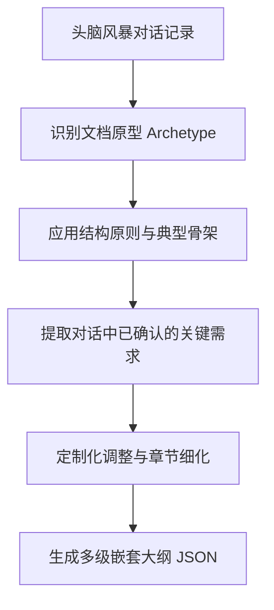

# 通用专业文档大纲生成与提示词优化设计

## 背景

在 Mind Organization 中，大纲生成是整个写作流的核心起点。当前的 `OUTLINE_PROMPT` 主要依赖大模型自由发挥，缺乏对特定行业和文档类型的结构约束，导致大纲生成存在以下局限：

1. **结构推理缺乏引导**：仅设定了“3-8 个顶层章节”的弱约束，导致生成的大纲缺乏严密的专业逻辑。
2. **缺乏行业常识和专业逻辑**：例如，技术方案往往需要系统架构与技术选型，投标技术方案必须包含资质响应与售后服务，而当前模型在生成时容易遗漏这些关键章节。
3. **指令与输出的语言损耗**：现有的 `OUTLINE_PROMPT` 采用英文编写，用于生成中文大纲时，跨语言推理容易导致词不达意或生成思路偏西化。
4. **定位局限**：原设计偏向特定的“系统建设方案”，而用户的实际应用场景涵盖了各行各业技术人员的专业文档，包括立项汇报、招投标文档、咨询研究报告等，需要从“特定方案工具”升级为“通用专业文档写作工具”。

为解决这些问题，本设计提出了一种**文档原型（Archetype）体系**，通过在提示词中注入不同文档类型的结构原则和骨架，引导大模型进行三步推理（识别原型 -> 应用原则 -> 结合对话适配），从而生成高质量、符合行业规范的专业文档大纲。

---

## 架构设计：文档原型（Archetype）体系

本方案不采用硬编码固定模板的方式，而是抽象出 **8 种通用文档结构原型**。大模型在处理用户对话时，将遵循以下推理流：



### 8 种文档原型定义

| 原型标识 | 原型名称与适用场景 | 结构原则 | 典型骨架 | 写作焦点与深度 |
| :--- | :--- | :--- | :--- | :--- |
| **A. technical_solution** | **建设方案型**<br>（技术方案、系统建设方案、数字化转型方案、实施方案等） | 先全局后局部，先架构后细节，逻辑自顶向下。 | 项目概述 → 需求分析 → 总体设计 → 详细设计 → 安全与运维保障 → 实施计划与步骤 → 项目保障体系 | 架构设计需有图、技术选型需有理由、性能指标需量化。 |
| **B. proposal** | **论证立项型**<br>（立项汇报材料、可行性研究报告、项目建议书等） | 先讲必要性，再讲可行性，最后讲投入产出。 | 项目背景 → 必要性分析 → 可行性分析 → 建设方案概述 → 投资估算 → 效益与风险分析 → 组织保障与进度安排 | 必要性需有政策或数据支撑，投资和效益必须量化。 |
| **C. bidding** | **招投标型**<br>（招标技术文档、投标技术方案、技术评分标准等） | 严格对应招标文件要求，合规优先，差异化其次。 | 公司概况与资质 → 对项目理解与需求分析 → 总体与详细技术方案 → 项目实施方案 → 售后服务与培训 → 经典案例 → 报价（如适用） | 逐点响应招标要求，突出差异化竞争优势，售后需具备可执行性。 |
| **D. consulting** | **咨询研究型**<br>（咨询报告、行业研究报告、白皮书、调研报告等） | 数据驱动，从现象到本质，从分析到建议。 | 研究概述/摘要 → 行业与市场背景分析 → 现状评估与对标 → 问题诊断与成因 → 策略与路径建议 → 实施路线图 → 风险与应对 | 数据引用需标明来源和时效，使用 SWOT/PEST 等经典分析框架，建议需具备落地性。 |
| **E. planning** | **规划战略型**<br>（发展规划、战略规划、技术路线图等） | 从愿景到路径，分阶段，分优先级。 | 现状与挑战 → 愿景与战略目标 → 总体策略 → 重点任务/重点工程 → 阶段规划与路线图 → 保障措施 | 目标需 SMART 化，任务需区分近中远期，资源配置需务实。 |
| **F. assessment** | **评估审计型**<br>（评估报告、测评报告、合规审查报告、安全评估等） | 标准先行，逐项评估，结论明确，可追溯。 | 评估背景与范围 → 评估标准/指标体系 → 评估方法与工具 → 逐项评估结果 → 综合评价结论 → 改进建议与防范措施 | 评估标准必须明确引用来源，结果需有清晰等级或评分，改进建议需具备可操作性。 |
| **G. operations** | **运维管理型**<br>（运维方案、管理制度、应急预案、操作手册等） | 职责清晰，流程可执行，应急有预案。 | 总则与适用范围 → 组织架构与职责分工 → 常规管理流程/操作步骤 → 监控、预警与检查 → 应急处置流程 → 考核与持续改进 | 流程必须有明确的执行步骤和责任人，应急预案需分级响应。 |
| **H. general** | **通用专业型**<br>（技术选型报告、架构设计文档、测试方案、接口规范等） | 结构服务于具体目的，逻辑清晰，不强套模板。 | 根据对话内容和具体文档目的自由构建。 | 逻辑自洽，重点突出，避免套模板。 |

> [!NOTE]
> **混合型文档处理**：当文档跨越多个原型时（如“投标技术方案” = `bidding` + `technical_solution`），以主要原型的结构原则为主框架，融入次要原型的关键章节（如以招投标资质和实施流程为框架，技术方案章节按照建设方案型展开）。

---

## 详细设计与代码变更

### 1. OUTLINE_PROMPT 重写 (src/lib/brainstorm/outline-prompt.ts)

将 `OUTLINE_PROMPT` 完全切换为中文指令，避免跨语言损耗。在其中注入 8 种文档原型的结构原则、典型骨架和写作焦点，并设计三步推理引导模型生成。

大纲 JSON 返回结构中新增 `documentType` 字段，支持表示单一原型（如 `technical_solution`）或混合原型（如 `bidding+technical_solution`）。

### 2. FACILITATOR_PROMPT 阶段二（Phase 2）大纲方向选项动态化 (src/lib/brainstorm/facilitator.ts)

修改 `FACILITATOR_PROMPT`，不再输出通用的 "Thematic / Timeline / Problem-driven" 三选项，而是让 Facilitator 大脑先识别当前的文档原型，进而生成**针对该原型定制的大纲方向选项**。

**示例**：
若识别为“投标技术方案”（`bidding`）：
- **方向 A (推荐)：招标要求响应式** —— 严格对应招标文件的技术要求逐点组织，便于评委打分。
- **方向 B：方案价值驱动式** —— 从客户痛点出发，展示核心方案的价值和差异化技术优势。
- **方向 C：全生命周期式** —— 按规划、建设、运维、优化的全流程组织，展示全局视野。

### 3. FACILITATOR_PROMPT 阶段一（Phase 1）问题维度扩展 (src/lib/brainstorm/facilitator.ts)

为了使 Facilitator 在第一阶段的提问能够全面覆盖各类专业文档的需求，扩展其提问的维度，包含项目可行性、招投标指标、评估标准等：

- **技术方案/系统设计**：现有架构、技术偏好、性能/安全指标、部署约束。
- **项目建议书/可行性研究**：政策背景、投资估算、预期效益、审批受众。
- **招投标文档**：招标要求来源、评分标准、竞争对手、公司资质与优势。
- **咨询/研究报告**：研究范围、数据源、分析框架、决策目标。
- **战略规划/路线图**：现状成熟度、愿景、时间跨度、资源约束。
- **评估/审计报告**：评估标准、范围边界、测评方法。
- **运维/管理文档**：组织架构、既有流程、合规要求、SLA 指标。

### 4. outline-worker 对话格式化指令增强 (src/lib/queue/workers/outline-worker.ts)

在调用生成大纲的 Worker 中，对输入给大模型的 user 提示词进行结构化：
1. 明确要求模型在生成大纲前，先提取文档类型、核心需求约束、用户选择的大纲方向、特殊排除内容等摘要信息。
2. 避免大模型直接处理海量对话文本时，丢失用户已明确确认的章节或偏好。

---

## 数据结构与兼容性

### 1. 数据结构扩展

生成的 Outline JSON 包含 `documentType` 字段：

```typescript
export interface Outline {
  title: string;
  documentType: string; // 例如: 'technical_solution', 'bidding+technical_solution' 等
  sections: OutlineSection[];
}
```

### 2. 兼容性设计

- **数据向下兼容**：对于历史 Session 生成的旧大纲，解析时 `documentType` 默认设为空字符串或 `"general"`。
- **数据库零迁移**：由于大纲是以 JSON 格式序列化存储在 `Draft.outline` 和 `BrainstormSession.outline` 等字段中，因此无需对数据库进行 Schema 变更。
- **页面展示**：在前端大纲预览页，可以可选地提取 `documentType`，为用户提供文档类型的可视化标签（例如“当前识别文档原型：投标技术方案”）。

---

## 验证与测试方案

### 自动化测试
1. 执行 `npm test`：确保已有的 `outline-tree` 核心计算逻辑及状态机测试用例不受影响。
2. 执行 `npm run build`：确保 TypeScript 类型检查无误。

### 手动功能验证
1. **测试场景 A (系统建设方案)**：
   - 目标：生成“智慧医疗系统建设方案”。
   - 预期：识别为 `technical_solution` 原型，Phase 2 提供模块化设计、全生命周期建设等选项，生成的大纲包含总体设计、详细设计等规范章节。
2. **测试场景 B (立项可行性报告)**：
   - 目标：生成“新能源充电桩部署立项可行性报告”。
   - 预期：识别为 `proposal` 原型，生成的大纲包含必要性分析、可行性分析、投资估算与效益分析。
3. **测试场景 C (投标技术方案)**：
   - 目标：生成“XX集团云平台迁移投标技术方案”。
   - 预期：识别为 `bidding+technical_solution` 混合原型，包含资质案例、售后维护、技术迁移实施等综合结构。
4. **异常情况测试**：
   - 输入模糊需求或短句（如“写个简单的测试方案”），模型应优雅退化为 `general` 原型，而不出错。
